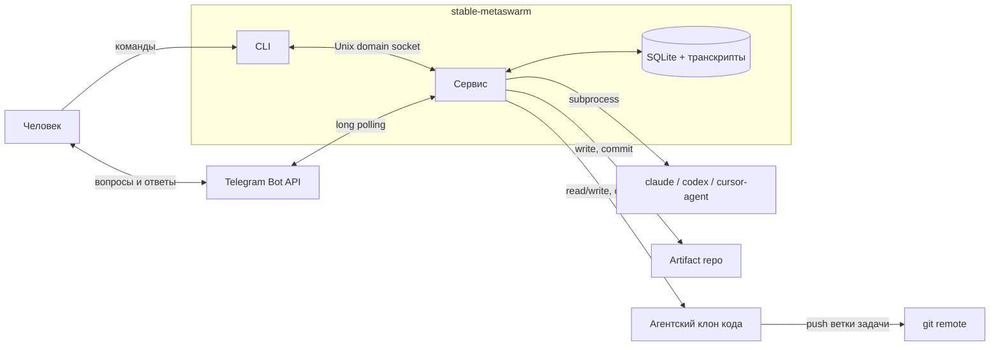
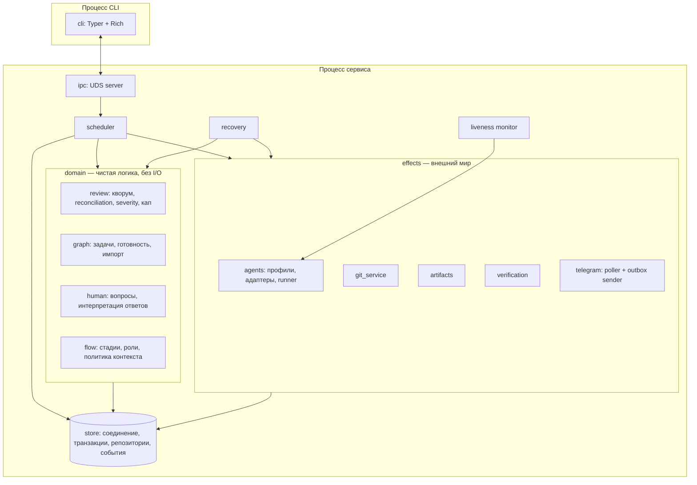
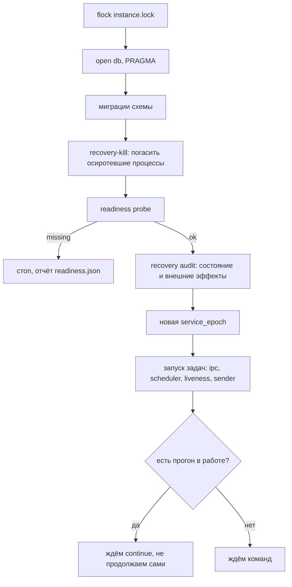
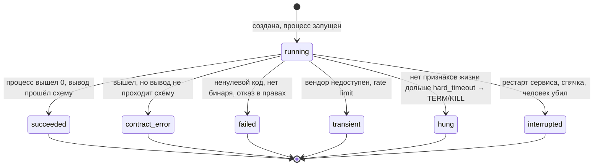
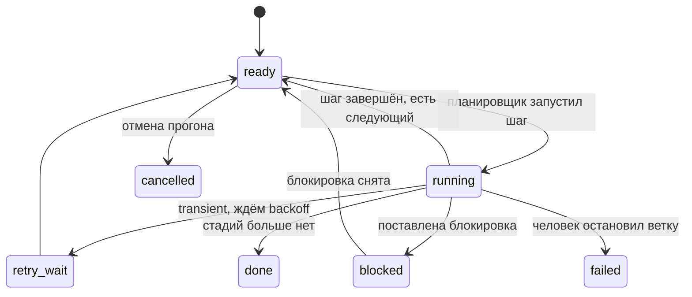
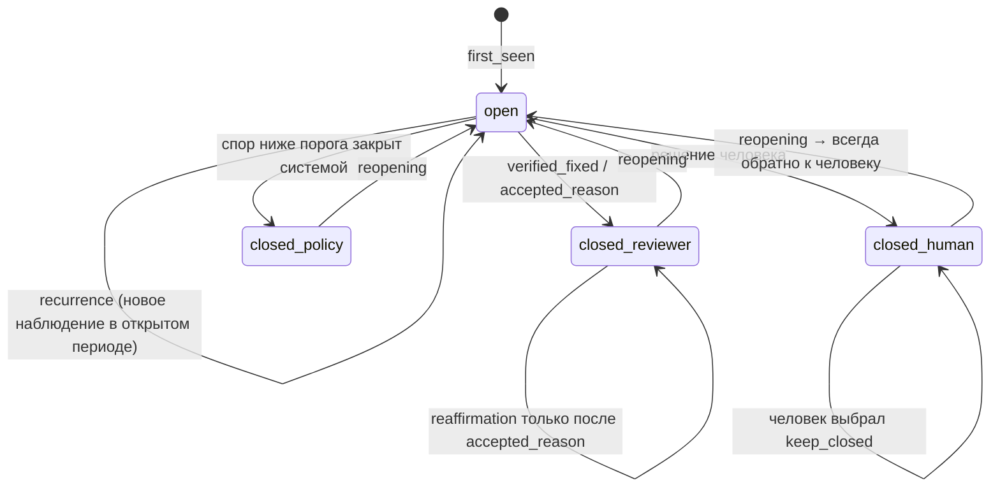

# Архитектура

Дата: 2026-08-04. Статус: после дополнительного ревью T1.5 исправлена
достижимость `cap_exhausted_new`, защищённый вопрос Q44 закрыт явным решением
владельца, для follow-up observations выбран вариант B в Q45.
Production-реализацией не проверена.

Верхнеуровневая архитектура системы целиком: границы, компоненты, процессы,
потоки управления, машины состояний, обработка отказов. Что и почему решено —
`../metaResearches/decision.md`; как хранится состояние — `db-schema.md`; что
присылает агент — `agent-contracts.md`; в каком порядке это строить —
`task-plans.md`.

---

## 1. Контекст: что внутри и что снаружи



Что система **не** делает и не будет: не открывает TCP-порт наружу, не ходит в
трекеры, не принимает вебхуки, не устанавливает и не чинит окружение, не
запускает больше одного прогона за раз.

Единственный внешний вход, кроме локального CLI, — Telegram long polling.
Единственный исходящий сетевой трафик, кроме вендорских CLI, — тот же Telegram.

---

## 2. Пять правил, из которых следует остальное

1. **Один процесс — один писатель.** Сервис владеет базой и дочерними
   процессами. Всё остальное — читатели или клиенты.
2. **Домен не выполняет внешних эффектов.** Он принимает факты и возвращает
   решения; исполняет их сервисный слой. Отсюда следует, что весь протокол ревью
   тестируется без единого запуска процесса.
3. **Переход состояния и его событие пишутся одной транзакцией.** Без
   исключений. Всё, что нельзя вписать в транзакцию, оформляется как
   intent → effect → reconcile (§8).
4. **Детерминированное делает код, суждение делает агент** (`decision.md` §2).
   Спор «а не проще ли поручить это модели» решается этим правилом, а не
   удобством.
5. **Абстракция появляется вместе со второй реализацией, не раньше.** Модульная
   граница — бесплатна и ставится сразу; `Protocol`, реестр и conformance-suite —
   нет, и не пишутся.

---

## 3. Компоненты



**Правило зависимостей одно:** `domain` не импортирует ничего из `effects` и не
знает про процессы, сокеты и сеть. Всё, что домен хочет от внешнего мира, он
возвращает как значение. Обратное направление разрешено: `effects` и `scheduler`
знают домен.

### 3.1. Раскладка пакетов

```
src/
  metaswarm/
    cli/                 отдельный процесс: команды, рендер, клиент UDS
    service/
      app.py             composition root: сборка зависимостей, запуск задач
      ipc.py             UDS сервер, протокол команд
      scheduler.py       что запускать дальше
      recovery.py        audit при старте
      liveness.py        heartbeat, soft/hard timeout, убийство группы
      lock.py            instance lock
      readiness.py       проверка среды до приёма первого запроса
    domain/
      review/            протокол findings: кворум, reconciliation, severity, кап
      graph/             task_graph: пять операций, атомарный импорт
      human/             формирование вопроса, разбор ответа
      flow/              модель флоу, стадии, роли, контекст
    store/
      db.py              PRAGMA, единый writer, транзакции
      migrations/        NNNN_*.sql
      repo/              по агрегатам: run, attempt, campaign, finding, question…
      events.py          append-only журнал
    agents/
      profiles.py        профиль как данные: argv, env-маппинг, secret_ref
      adapters/          claude.py, codex.py, cursor.py
      runner.py          create_subprocess_exec, process group, kill
      parse.py           разбор структурированного вывода
      redaction.py       замена секретов до записи
    effects/
      git_service.py     разрешённые операции; запрещённых просто нет
      artifacts.py       запись, манифест, digest
      verification.py    политика argv + исполнение VerificationPlan
      telegram/          poller.py, sender.py, api.py
    config/
      instance.py        instance profile: РабОрк / СвойОрк
      project.py         конфиг проекта: рецепты, права на push
      flow_loader.py     YAML + Pydantic extra="forbid"
      canonical.py       канонический JSON и hash
    obs/
      logging.py, tree.py, transcripts.py
```

Физическая раскладка — `src-layout`, а не flat layout. В `pyproject.toml`
setuptools discovery дополнительно ограничивается `where = ["src"]` и
`include = ["metaswarm*"]`: находящиеся рядом `fixtures/` и `refs/` не могут
случайно стать namespace-пакетами. Импорт из корня checkout без установленного
дистрибутива при этом не работает и не маскирует ошибку packaging.

Общая dev-граница проекта — `pyproject.toml` + `uv.lock`. Задача, добавляющая
или меняющая библиотеку, обновляет оба файла. Единственная точка локальной
проверки — `./scripts/check.sh`; она запускает инструменты через
`uv run --locked`, не переписывает устаревший lockfile и возвращает 127 при
отсутствующем `uv`. Это tooling разработки: runtime и readiness сервиса от
наличия `uv` не зависят.

### 3.2. Почему `domain/review` — отдельный пакет без I/O

Это не архитектурная эстетика, а прямое следствие требований. Протокол findings —
«главная ценность и главная сложность» (`decision.md` §1), а его приёмочные
сценарии (§14) — это в основном комбинаторика: три правки против четырёх
проверок, отказ не принят, ревьюер сослался на закрытый ID, новое замечание на
последнем круге. Каждый такой сценарий должен проверяться таблицей входов и
ожидаемым решением, за миллисекунды и без вендорских CLI.

Если решение о продолжении цикла принимается внутри функции, которая заодно
запускает процесс и пишет в базу, эти сценарии станут интеграционными тестами с
фикстурами — и их напишут не все.

---

## 4. Процессная модель

### 4.1. Процессы

| Процесс | Сколько | Живёт |
|---|---|---|
| Сервис | Ровно один на каталог состояния | Долго, между прогонами |
| CLI | Сколько угодно, короткоживущие | На время команды |
| Агент | По одному на активную попытку | На время шага |
| Верификация | По одному на исполняемую команду плана | Секунды-минуты |

Сервис поднимается своей обёрткой и **ничего не требует от `systemd`**
(`decision.md` §4, правило переносимости: в WSL2 systemd не гарантирован). Unit
для VPS — опция, не зависимость.

### 4.2. Конкурентность внутри сервиса

asyncio, одна событийная петля, следующие постоянные задачи:

| Задача | Что делает | Чем будится |
|---|---|---|
| `ipc_server` | Принимает команды CLI | Соединение на сокете |
| `scheduler` | Решает, что запускать дальше | Очередь событий домена |
| `liveness` | soft/hard timeout по монотонным часам | Тик 1 с |
| `tg_poller` | `getUpdates` с длинным таймаутом | Ответ Telegram |
| `tg_sender` | Отправка из outbox | Запись в outbox, ретрай с backoff |

Плюс по одной задаче на активную попытку агента — читает stdout/stderr, обновляет
heartbeat, дожидается завершения.

**Доступ к базе — через единственный выделенный поток с очередью.** `sqlite3`
блокирующий, и вызывать его прямо из петли нельзя. WAL позволил бы читать
параллельно с несколькими соединениями, но при нашей нагрузке (десятки
транзакций в минуту) очередь на один поток стоит ничего и убирает целый класс
ошибок: невозможно случайно открыть вложенную транзакцию из двух корутин.
Отдельные read-only соединения добавляются, только если появится тяжёлое
чтение — сейчас это была бы та самая универсализация «на вырост», которую §2
запрещает.

### 4.3. Instance lock

```
<state_dir>/instance.lock     flock LOCK_EX | LOCK_NB
<state_dir>/instance.json     pid, boot_id, started_at, core_version, heartbeat
```

`flock` снимается ядром при смерти процесса — это защищает от «сервис убит,
замок остался». JSON рядом нужен для внятного сообщения: не «занято», а «держит
pid 4711, запущен вчера в 20:14, heartbeat 3 секунды назад». Если `flock` взят,
но heartbeat в JSON старше минуты, сообщение говорит и об этом: процесс жив, но
не отвечает.

Каталог состояния **вне агентского клона кода — всегда** (`decision.md` §5),
иначе служебные файлы выглядят как untracked-изменения в workspace ревьюера и
валят его read-only контракт.

### 4.4. Старт сервиса

Порядок жёсткий, каждый шаг имеет причину:



- **Миграции до всего остального** (`decision.md` §5): иначе и гашение, и аудит
  читают записи схемой, которой они не соответствуют.
- **Гашение осиротевших процессов — до readiness.** Это исправление первой
  редакции, где recovery целиком шёл после проверки среды. Сценарий, который она
  ломала: сервис упал, агент жив, за ночь обновление снесло бинарь профиля.
  Readiness говорит «missing», сервис не стартует — и осиротевший агент
  продолжает писать в рабочий каталог, теперь уже без всякого надзора.
  Гашение ничего не требует от среды: ему нужна только база и `/proc`.
  Поэтому оно выполняется всегда, **даже если старт дальше не состоится**.
- **Readiness до остального recovery**: сверять артефакты и git, когда среды
  нет, бессмысленно; при любом `missing` сервис не стартует и пишет
  `readiness.json`.
- **Recovery до приёма команд**: команда `continue`, пришедшая до аудита,
  запустила бы вторую попытку поверх живой осиротевшей.
- **Прогон не продолжается сам** (`decision.md` §4): восстановление состояния и
  продолжение работы — разные вещи.

### 4.5. Recovery, часть первая: гашение (до readiness)

```
Для каждого step_attempt с outcome IS NULL из прошлых эпох:
  1. есть attempt_liveness?
       да  → сверить pid + proc_start_ticks; группа жива → TERM → grace → KILL
       нет → процесс мог стартовать до записи pid: искать по маркеру
  2. независимо от (1) — сканировать /proc/*/environ на
     METASWARM_ATTEMPT_ID; каждую найденную группу гасить
  3. outcome = 'interrupted', событие
```

Шаг 1 — тот, ради которого в `attempt_liveness` лежит `proc_start_ticks`: PID
переиспользуется ОС, и «жив ли процесс 4711» без времени старта отвечает про
чужой процесс.

Шаг 2 закрывает окно между `spawn` и записью `attempt_liveness`. Он выполняется
**всегда**, а не только когда записи нет: процесс мог сменить группу, а маркер в
окружении сменить нельзя. Гасятся все найденные группы, а не первая.

**Если `/proc/*/environ` нечитаем, а попытка без `attempt_liveness` есть —
сервис не стартует.** Это единственная комбинация, в которой мы не можем
доказать, что осиротевшего процесса нет, а запуск дубля поверх живого агента
портит рабочий каталог молча. Читаемость `environ` проверяется в readiness и
отдельным приёмочным тестом: на hardened-ядрах доступ к чужому `environ`
ограничен, и хотя наши дочерние процессы принадлежат тому же пользователю,
полагаться на это без проверки нельзя.

### 4.6. Recovery, часть вторая: аудит (после readiness)

```
1. Сверить незавершённые внешние эффекты (§8): привести ветку к input_sha
   прерванной авторской попытки, проверить artifact repo по digest,
   дослать неотправленное из outbox.
2. Проверить полноту: наблюдения без связи, круги с решениями, но без
   результата, findings без finding_round в открытом круге. Непривязанные
   observations в открытом круге означают незавершённый reconciliation, который
   надо продолжить; в круге с уже записанным result это нарушение инварианта.
3. Проверить граф: циклы, ложный успех (запрос db-schema §9).
4. Ветки, которые были running → blocked(awaiting_continue).
```

Пункт 4 — не мелочь. Ветка, которая была в работе, после рестарта не готова к
работе: её попытка прервана, и решение о повторе принимает человек командой
`continue`. Без явной блокировки планировщик подхватил бы её сам.

---

## 5. Планировщик

Единственное место, которое решает «что запускать». Не таймерный цикл, а реакция
на события:

```
событие → пересчёт готовности затронутой ветки → набор действий
```

Источники событий: завершение попытки, ответ человека, команда CLI, тик
liveness, истечение retry-задержки.

Для каждой ветки в состоянии `ready` планировщик спрашивает у домена, какой шаг
следующий, и получает описание работы: роль, профиль, промпт, контекст,
ограничения. Дальше — проверки перед запуском, все обязательные:

| Проверка | Отказ означает |
|---|---|
| Нет активной попытки на этот шаг | Гонка; partial unique index всё равно не даст вставить |
| Нет открытых блокировок на ветке | Ветка стоит не просто так |
| Профиль резолвится, secret_ref непуст | Стоп с внятным сообщением |
| Для ревьюера: пара provider+model не в `reviewer_exposure` | Нарушение свежести |
| Совпадение `rubric_hash` у всех линий кворума | Contract error **до** запуска |
| Drift check пройден или дрейф принят | Отказ `continue` со списком расхождений |

Последняя проверка в списке рубрик — из `decision.md` §6.1: кворум из линий с
разными версиями рубрики меряет по разным шкалам, и ловить это после того, как
обе линии отработали, поздно и дорого.

**Один прогон за раз** — принятое ограничение (`decision.md` §3), поэтому
планировщик не занимается очередями и приоритетами. Параллелизм внутри прогона —
только независимые ветки, и в v1 их порождает лишь ожидание человека: реализация
задач идёт последовательно по графу.

---

## 6. Машины состояний

### 6.1. Попытка



Бюджеты раздельные: `hang_retry_budget`, `vendor_retry_budget`,
`contract_retry_budget`. По исчерпании любого — вопрос человеку, и формулировка
у каждого своя: «CLI зависает» и «модель трижды вернула невалидный вывод» — это
не «трижды не согласились».

**Ни один исход, кроме `succeeded`, не двигает счётчики капа.** Ночной
перезапуск ноутбука не съедает круг ревью.

### 6.2. Кампания и круг

```mermaid
stateDiagram-v2
  [*] --> discovery: кампания открыта, линии набраны
  discovery --> reconciliation: слепые выводы зафиксированы
  reconciliation --> fix_cycle: наблюдения классифицированы, ID выданы
  reconciliation --> closed_clean: нет работы автору
  fix_cycle --> fix_cycle: правка автора → проверка → needs_revision
  fix_cycle --> fix_cycle: escalated → ждём человека; разрешена правка → продолжаем
  fix_cycle --> closed_clean: проверка вернула clean
  fix_cycle --> closed_escalated: человек принял результат или остановил ветку
  discovery --> closed_cancelled: отмена прогона
  reconciliation --> closed_cancelled: отмена прогона
  fix_cycle --> closed_cancelled: отмена прогона
  closed_clean --> [*]
  closed_escalated --> [*]
  closed_cancelled --> [*]
```



`escalated` сначала закрывает **круг**, но не кампанию: пока открыт
`human_question`, `review_campaign.state = fix_cycle` и `closed_at IS NULL`, а
ветку удерживает blocker. Если человек разрешает ещё одну правку, увеличивается
лимит стадии и та же кампания продолжает self-transition с прежними счётчиками.
`closed_escalated` выставляется только после окончательного ответа «принять» или
«остановить» и потому действительно остаётся терминальным.

### 6.3. Решение о продолжении цикла

Самое опасное место всей системы: обе естественные формулировки капа дают ошибку
на единицу с разных сторон (`decision.md` §7.1). Поэтому решение оформлено одной
функцией без ветвлений в других местах.

`decide_after_check` применяется только к `fix_check`, когда кампания уже в
`fix_cycle`. Первичный круг `discovery` закрывается после reconciliation:
домен T1.5 возвращает `clean`, если открытых findings нет, либо
`needs_revision`, если они есть; вертикальный срез T1.7b отображает этот исход
в переход кампании и пишет `review_round.result` атомарно. Так первичный круг
входит в `review_check_count`, но не проходит через функцию капа, рассчитанную
на проверки после авторских правок.

Перед `decide_after_check` текущий `fix_check` обязан завершить ещё один шов.
Каждый владелец finding'а возвращает решения по выданным ему ID и может
добавить два разных вида evidence. Follow-up observation внутри решения уже
имеет target во внешнем `finding_id`: T1.6 проверяет `unchanged_from` на тот же
finding и период, а T1.7b пишет observation и `recurrence` одной транзакцией с
решением. Только `new_observations` без известной личности идут в T1.5. Если они
есть, T1.5 проводит reconciliation на этом же `review_round` и на
**post-decision ledger**: все валидные `verified_fixed`/`accepted_reason` этого
check уже отражены в status. Поэтому finding, только что закрытый решением,
нельзя сослать как `existing_open`; reconciler обязан выбрать closed outcome.
T1.5 выдаёт новым группам личности, связывает повторы и добавляет открытые
findings в facts текущей проверки. После обоих путей полный запрос observations
без link обязан быть пуст, только затем T1.6 вычисляет итоговый status/severity,
а T1.4 принимает решение. Поэтому finding с
`first_round_id == current_round_id` достижим и даёт `cap_exhausted_new` при
исчерпанном cap. Campaign при этом остаётся в `fix_cycle`: `reconciliation`
здесь — подшаг круга, а не состояние кампании.

```python
def decide_after_check(campaign, counters, stage) -> Decision:
    # Решение одновременно задаёт переход и сохраняемый round_result.
    assert campaign.state == FIX_CYCLE

    # 1. Открытых findings нет — успех при любых счётчиках.
    #    В том числе если это была четвёртая проверка.
    if not has_open_findings(campaign):
        return CloseCampaign(success=True, round_result=CLEAN,
                             campaign_state=CLOSED_CLEAN)

    # 2. Спор не ниже порога уходит человеку СРАЗУ, не дожидаясь
    #    исчерпания кругов.
    if dispute := find_escalating_dispute(campaign, stage.severity_threshold):
        return AskHuman(reason="dispute", snapshot=dispute.snapshot(),
                        round_result=ESCALATED, campaign_state=FIX_CYCLE)

    # 3. Открытые findings есть, правки ещё есть — следующий круг.
    if counters.author_revision_count < stage.max_author_revisions:
        return StartAuthorRevision(round_result=NEEDS_REVISION)

    # 4. Правки исчерпаны. Причина различается по кругу первого
    #    появления открытых замечаний.
    reason = ("cap_exhausted_new"
              if any_finding_first_seen_in_last_round(campaign)
              else "cap_exhausted_same")
    return AskHuman(reason=reason, round_result=ESCALATED,
                    campaign_state=FIX_CYCLE)


def decide_after_revision(...) -> Decision:
    # Проверка запускается ВСЕГДА, в том числе после последней
    # разрешённой правки. Именно она и есть четвёртая.
    return StartReviewCheck()
```

Два утверждения, которые проверяются тестом, а не читаются как комментарий:

- третья правка **не** блокирует ветку до того, как её проверят
  (`decide_after_revision` не смотрит на счётчики вовсе);
- чистая четвёртая проверка **не** блокирует ветку (первая ветка
  `decide_after_check` стоит до всех счётчиков).

`review_check_count <= max_author_revisions + 1` — assert в конце транзакции, а
не второй гейт. Если он сработал, это дефект планировщика, а не ситуация,
которую надо обработать.

`AskHuman` в этой функции — решение «закрыть круг и поставить human gate», а не
`CloseCampaign`: round получает `escalated`, campaign остаётся `fix_cycle`.
Ответ человека обрабатывает T1.16. Вариант «ещё одна правка» увеличивает
`stage_execution.max_author_revisions` и продолжает ту же кампанию; два
окончательных варианта переводят её в `closed_escalated`.

### 6.4. Ветка



«Ждёт человека» — не состояние, а `blocked` **плюс** блокировка типа
`human_question`. Так CLI показывает причину, а не только факт, и инвариант
«ветка стоит не просто так» проверяется одним запросом.

### 6.5. Замечание



Период накопления severity живёт **не по этой диаграмме**, а по своей: его
закрывают только `verified_fixed` и решение человека. Это два разных жизненных
цикла одной записи, и в схеме они разведены (`db-schema.md` §5.6).

### 6.6. Спор ниже порога: от решения ревьюера до закрытия замечания

Путь `insists → policy_closed` собирается из трёх разных мест документа, и
именно поэтому его стоит показать одной последовательностью — он единственный,
где замечание закрывается **без** согласия ревьюера, автора или человека.

```
ревьюер: insists на отказ автора
    │
    ├─ escalation_severity >= порога стадии
    │     → вопрос человеку немедленно, не дожидаясь исчерпания кругов
    │     → круг result = 'escalated'
    │
    └─ escalation_severity <  порога стадии
          → finding_resolution: resolution = 'policy_closed',
                                authority   = 'policy',
                                closes_severity_period = 0
          → замечание закрыто
          → после обработки всех findings:
                открытых нет                 → clean, кампания завершена
                спор ≥ порога или кап исчерпан → escalated, вопрос человеку
                иначе остались открытые       → needs_revision, правка автора
          → в CLI попадает в список «автоматически принятые отказы»
```

Три следствия, каждое намеренное:

- **`closes_severity_period = 0`** — накопитель переживает такое закрытие. Спор,
  задавленный порогом сегодня, всплывёт сам, если завтра evidence станет
  серьёзнее: новое наблюдение поднимет `escalation_severity` до порога, и вопрос
  человеку возникнет штатно, **впервые**.
- **Отдельного результата круга `disputed` нет.** Факт спора уже хранится как
  `policy_closed`; дублировать его агрегатом круга не нужно. Если открытых
  замечаний не осталось, текущий круг получает `clean` и сразу завершает
  кампанию. Дополнительная проверка невозможна и не нужна: новой
  `author_revision`, которую она могла бы проверять, не было.
- **Отсюда важность CLI-отчёта.** Автоматически принятые отказы показываются
  отдельным списком (`decision.md` §12) именно потому, что в остальном они
  невидимы: ветка едет, прогон успешен, а ревьюер при этом настаивал. Систематический
  перекос порога виден только в этом списке.

---

## 7. Ключевые последовательности

### 7.1. Кампания ревью от начала до конца

```
1. Открытие кампании
   ├─ создать review_subject (или взять существующий) и review_campaign
   ├─ снять snapshot: severity_threshold, policy_version
   ├─ набрать линии: профили, чьи пары provider+model свободны по
   │  reviewer_exposure для этой пары subject+revision
   └─ TX: campaign + lanes + round(1, discovery) + событие

2. Слепая фаза, линии параллельно
   ├─ каждой линии: задача, ревизия, рубрика. Ledger НЕ передаётся
   ├─ в первом раунде линии слепы и друг к другу
   ├─ disposable read-only checkout на точном SHA
   └─ по завершении каждой: TX: observations + attempt.outcome + exposure

   Одна линия упала, вторая закончила → частичный результат не
   засчитывается как консенсус: круг не закрывается, отработавшая
   линия ждёт повтора упавшей в пределах бюджета.
   Бюджет исчерпан → вопрос человеку, см. ниже.

3. Первичный reconciliation
   ├─ вход: наблюдения всех линий + ledger (открытые ID + закрытые
   │  из кампаний, чей subject входит в текущий)
   ├─ код склеивает точные совпадения по dedup_key внутри круга
   ├─ агент предлагает группы и классифицирует каждое наблюдение
   ├─ рантайм валидирует: разбиение исчерпывающее, ссылки допустимы,
   │  existing_open только на открытый ID
   └─ TX: finding (новые ID) + links + событие

4. Цикл правок
   loop:
     ├─ автору: компактный ledger (ID, severity, title, статус)
     ├─ автор возвращает disposition на КАЖДЫЙ открытый ID
     ├─ TX: finding_round.disposition (все или ни одного)
     │       + author_revision + attempt.outcome
     ├─ владельцу каждого finding'а: проверить исправление или отказ;
     │  ответ может содержать follow-up observation известного ID
     │  и отдельные new_observations
     ├─ TX: finding_round.reviewer_decision
     │       + follow-up observation + recurrence после проверки T1.6
     │       + resolutions + unclassified new_observations
     ├─ если new_observations не пусты:
     │    reconciliation T1.5 на текущем fix_check
     │    → новые finding/links/finding_round
     ├─ assert: observations текущего round без link отсутствуют
     ├─ собрать open set после всех решений и reconciliation
     ├─ TX: review_round.result + событие
     └─ decide_after_check(...) → следующий круг | успех | человек

5. Закрытие или human gate
   ├─ clean: TX campaign=closed_clean + stage/branch + событие
   ├─ escalated: TX round=escalated + вопрос/outbox/blocker + событие;
   │             campaign остаётся fix_cycle
   └─ окончательный ответ человека: TX campaign=closed_escalated
                 + stage/branch + resolutions + событие
```

Reconciliation T1.5 — единственное место, где выдаётся **новый** finding ID. Он
вызывается для первичных слепых observations в шаге 3 и для
`new_observations` каждого `fix_check` в шаге 4. Уже выданная личность
**никогда** не пересчитывается сопоставлением: после правки автора номера строк
сдвигаются, а модель переописывает ту же проблему другими словами, и контентный
ключ ломается именно в последующих кругах, ради которых он и нужен.

### 7.1.1. Линия исчерпала бюджет: деградированный кворум — решение человека

Терминальное поведение, а не бесконечное ожидание. Вопрос человеку с
`reason = 'lane_failure'` и тремя вариантами:

| Вариант | Что делает система |
|---|---|
| Продолжить деградированным кворумом | Круг закрывается по результатам отработавших линий; факт понижения кворума пишется в `review_campaign` и виден в CLI |
| Заменить линию другим профилем | Отбор идёт заново, с теми же правилами свежести и запретом на автора |
| Остановить ветку | Ветка неуспешна, соседние продолжают |

**Понижать кворум система сама не имеет права.** Кворум — это заявленное число
независимых мнений, и молчаливое «одного хватит» обесценивает решение, принятое
на его основе. Тем более что причина отказа линии обычно внешняя (кончился
лимит, протух логин), то есть на качество проверки не указывает никак — просто
мнений стало меньше, чем договаривались.

Факт деградации хранится, а не только упоминается в вопросе: при разборе «почему
это ревью ничего не нашло» число фактически отработавших линий — первое, что надо
знать.

### 7.1.2. Reconciliation не удался: человек как запасной классификатор

По исчерпании `contract_retry_budget` на фазе reconciliation — вопрос человеку с
`reason = 'reconcile_failed'`. Механически разложить наблюдения «каждому свой
новый ID» **нельзя**, хотя соблазн есть: у рецидива новый ID означает новый
период накопления severity, то есть молчаливый сброс накопителей — ровно то,
против чего построена вся конструкция с выданной личностью.

Вопрос обязан нести **сырые наблюдения круга целиком**, а не только текст
ошибки: человек здесь выступает запасным reconciler'ом, и ему нужно то же, что
агенту — наблюдения обеих линий и ledger. Ответ мапится в те же четыре исхода.

### 7.2. Вопрос человеку

```
Задать:
  TX: human_question + notification_outbox + blocker(human_question) + событие
  ── commit ──
  sender транспорта: отправка, запись transport_message_id
  (падение до отправки → outbox не пуст → отправится после рестарта)

Ответить:
  tg_poller получает update
  TX: telegram_inbox(PK transport,update_id) + human_answer
      + blocker(human_question).cleared
      + blocker(awaiting_continue) НОВЫЙ
      + branch.state + событие
  ── commit ──
  дубль того же update_id: PK не даст вставить → обработка идемпотентна

Продолжить:
  CLI continue → drift check → снять awaiting_continue → ветка ready
```

Постановка `awaiting_continue` **в той же транзакции**, что и снятие
`human_question`, — не перестраховка: между двумя транзакциями существует момент,
когда ветка выглядит готовой, и планировщик её подхватит, не дождавшись человека.

Останавливается при этом **только эта ветка**. Соседние независимые работали всё
время и продолжают; `Run` вычисляется из веток и остаётся `running`. Глобальный
`paused` бывает ровно один — когда человек сам поставил прогон на паузу.

Для review-вопроса ответ меняет и кампанию. «Ещё одна правка» атомарно
увеличивает `stage_execution.max_author_revisions`, оставляет кампанию в
`fix_cycle` и ставит `awaiting_continue`; «принять» или «остановить» переводит
кампанию в терминальный `closed_escalated` вместе с соответствующим состоянием
стадии/ветки. Сам факт ожидания состоянием `closed_escalated` не кодируется.

### 7.3. Убийство и продолжение

```
kill -9 сервиса во время работы агента
  ├─ агент осиротел, продолжает писать в свой рабочий каталог
  ├─ старт сервиса: flock свободен (ядро снял)
  ├─ recovery: attempt.outcome IS NULL, epoch чужая
  │   ├─ pid+proc_start_ticks совпали → группа жива → TERM → grace → KILL
  │   └─ outcome = interrupted (бюджет не тратится)
  ├─ ветка → blocked(awaiting_continue)
  └─ continue → drift check → повтор шага с чистого листа
```

Ключевое: попытка становится `interrupted`, а не `failed`, и **не тратит
бюджет** — иначе ночной перезапуск ноутбука съедал бы круги ревью, которых никто
не проводил.

---

## 8. Внешние эффекты: intent → effect → reconcile

SQLite фиксирует локальное состояние и **намерение**. Наружу остаётся пять
эффектов, и у каждого — свой способ сверки (`decision.md` §6.6).

| Эффект | Намерение в транзакции | Идентификатор в эффекте | Сверка при старте |
|---|---|---|---|
| Запуск процесса агента | `step_attempt` (**до** spawn), `attempt_liveness` — сразу после | `METASWARM_ATTEMPT_ID` в окружении процесса | Ищем процесс по маркеру в `/proc/*/environ`; гасим группу, потом создаём новую попытку |
| Checkpoint-коммит в клоне | `step_attempt` (та же строка) | `attempt_id` в сообщении коммита | Ветка приводится к `input_sha` прерванной попытки; коммит остаётся в reflog |
| Запись в artifact repo | `artifact_revision` с `content_digest` | `run_id/stage_id/attempt_id` + digest | Тот же digest уже записан → no-op |
| Push ветки задачи | Отметка намерения в событии | Сам SHA | Идемпотентен: тот же SHA на том же ref |
| Отправка сообщения человеку | Строка `notification_outbox` | `question_id`, `update_id` на входящих | Неотправленное в outbox → отправить; дубль входящего → PK |

Три места здесь заслуживают отдельного объяснения, потому что все три —
исправления первой редакции.

**Намерение несёт `step_attempt`, а не `author_revision`.** Строка
`author_revision` — свершившийся факт и одновременно счётчик капа
(`db-schema.md` §5.2), и совместить в ней роль намерения нельзя: вставка до
`git commit` растит счётчик раньше, чем правка состоялась, вставка после
оставляет эффект без durable-намерения. Разделение: `step_attempt` создаётся до
запуска процесса и служит намерением для всего, что попытка сделает наружу;
`author_revision` вставляется в одной транзакции с `outcome = 'succeeded'`, уже
после того как checkpoint-коммит сделан.

**Повтор прерванной авторской попытки начинается от `input_sha` — это
compensate, а не reconcile.** Разница существенная и её стоит держать в голове:
для артефактов и push сверка **идемпотентная** (тот же digest, тот же SHA — эффект
принимается за выполненный), а для checkpoint — **компенсирующая** (эффект
отменяется, работа повторяется). Причина в том, что коммит прерванной попытки
фиксирует незаконченную работу, и продолжать поверх него значит строить на
середине оборванной мысли.

Цена названа прямо: можно повторно оплатить работу, которая фактически успела
завершиться до падения. Взамен незавершённый результат никогда не становится
основанием следующего шага. Ветка приводится к состоянию до попытки; работа
прерванного агента остаётся достижимой через reflog и целиком лежит в
транскрипте, но в линии работы её нет. Идентификатор в сообщении коммита
сохраняется — для аудита и чтобы такие коммиты были опознаваемы.

**Осиротевший процесс находится по маркеру в окружении.** До `spawn` pid
неизвестен, а между `spawn` и записью `attempt_liveness` есть окно — падение
внутри него оставляет живой процесс, о котором в базе нет ни pid, ни pgid.
Поэтому каждому дочернему процессу передаётся `METASWARM_ATTEMPT_ID`, и recovery
ищет по нему в `/proc/*/environ`, а не только по записанному pid. Дёшево на
Linux, а других сред у нас нет (`decision.md` §4: только WSL2 и VPS).

Гарантия по внешним сообщениям называется честно: **durable at-least-once с
идемпотентной обработкой**, а не exactly-once, которого у внешнего эффекта не
бывает.

### 8.1. Outbox транспортно-нейтрален

Домен создаёт `human_question` и блокировку; он **не** знает, что доставка идёт
Telegram'ом. Иначе декларация «домен не выполняет внешних эффектов» ломается на
первом же атомарном переходе — в первой редакции он включал запись в
`telegram_outbox` с обязательным `chat_id`.

```
domain          human_question + blocker + run_event
outbox          notification_outbox (transport, target_ref, body, markup)
transport       telegram_sender | cli_pending
```

`cli_pending` — не заглушка, а полноценный транспорт: сообщение остаётся в
outbox и выдаётся командой `ask`. Это позволяет пройти весь протокол вопросов до
того, как появится Telegram, и одновременно не даёт домену привыкнуть к
синхронности CLI: тест с асинхронным фейковым транспортом (доставка с задержкой,
дубль, потеря) пишется сразу.

---

## 9. Агенты

### 9.1. Профиль — данные

```yaml
profiles:
  claude-z:
    adapter: claude
    executable: claude
    base_args:
      - --safe-mode
      - --disable-slash-commands
      - --strict-mcp-config
    requested_model: opus
    env_map:
      ANTHROPIC_BASE_URL: "https://api.z.ai/api/anthropic"
      ANTHROPIC_AUTH_TOKEN: { secret_ref: "zai_key" }
      ANTHROPIC_MODEL: "glm-5.2"
      ANTHROPIC_DEFAULT_OPUS_MODEL: "glm-5.2"
      ANTHROPIC_DEFAULT_SONNET_MODEL: "glm-5-turbo"
      ANTHROPIC_DEFAULT_HAIKU_MODEL: "glm-4.5-air"
      ANTHROPIC_SMALL_FAST_MODEL: "glm-4.5-air"
    env_allowlist:
      - PATH
      - HOME
      - LANG
      - ANTHROPIC_BASE_URL
      - ANTHROPIC_AUTH_TOKEN
      - ANTHROPIC_MODEL
      - ANTHROPIC_DEFAULT_OPUS_MODEL
      - ANTHROPIC_DEFAULT_SONNET_MODEL
      - ANTHROPIC_DEFAULT_HAIKU_MODEL
      - ANTHROPIC_SMALL_FAST_MODEL
    soft_timeout_s: 120
    hard_timeout_s: 3600
    term_grace_s: 2
```

Рантайм сам собирает окружение и argv. Никаких bash-обёрток в `~/.local/bin`:
исчезает симлинк-хрупкость, и секрет не проходит через `bash`, где виден в
`ps aux` как аргумент.

Честная граница (`decision.md` §9.1): токен всё равно попадает в окружение
дочернего процесса, и агент с shell технически может его прочитать. Запрет
держится промптом. Что гарантируется — `secret_ref` в конфиге вместо значения,
redaction **до записи** транскрипта, отсутствие секрета в промпте, событии,
манифесте и артефакте.

`HOME` остаётся в allowlist намеренно: подписочная auth Claude хранится там.
Наследование пользовательских MCP, skills, agents и memory блокируется не
подменой HOME, а проверенными `base_args` плюс явным role-specific `--tools`.
Structured init обязан подтвердить ожидаемый toolset и пустые MCP/skills/memory
до того, как результат попытки может участвовать в кворуме.

### 9.2. Адаптер — механика семейства

Три адаптера: `claude`, `codex`, `cursor`. Каждый умеет ровно это:

```
check_installed()      → версия или отсутствие
build_argv(request)    → список без shell-интерполяции
read_only_flags()      → native-режим вендора
parse_stream(chunk)    → событие: текст, инструмент, финальный результат
detect_activity()      → признак жизни для heartbeat
extract_result()       → машинно выделяемый финальный вывод
resume_args(session)   → продолжение логической сессии
classify_exit(code, subtype) → attempt outcome
```

Проверенные контракты зафиксированы в `vendor-cli-contracts.md`; адаптеры не
имеют права подменять их прежними гипотезами.

Для Claude основной режим — `--safe-mode --disable-slash-commands
--strict-mcp-config --tools <role-toolset> -p --model <requested>
--output-format stream-json --verbose`. `--tools` заменяет набор инструментов;
`--allowedTools` только разрешает элементы уже доступного набора и границу
read-only не задаёт. `system/init.model` даёт `actual_model`, а init tool/MCP/
skills/memory сверяются с ролью. Успех требует финального `type=result`,
`subtype=success`, `is_error=false` и exit 0. Для Codex основной режим — `exec
--json`: результат — последний completed `agent_message` перед обязательным
`turn.completed`, также при exit 0. В Codex 0.146.0 SIGTERM наблюдён с **exit 0
без `turn.completed`**, поэтому один код возврата принципиально недостаточен.

`classify_exit` объединяет exit code, наличие protocol completion marker и
vendor subtype. Из проверенного: неизвестный флаг Claude 2.1.220 даёт 1,
неизвестный флаг Codex 0.146.0 — 2, SIGTERM Claude — 143, SIGTERM Codex может
дать 0 с незавершённым протоколом. Предполагаемые специальные Claude-коды 3/4 и
subtype `error_max_turns`/`error_context_window`/`error_permission` пока не
воспроизведены и контрактом не считаются. Spawn failure из-за отсутствующего
cwd классифицируется до vendor exit. TERM посылается группе процессов; после
проверенного консервативного grace 2 s следует SIGKILL.

### 9.3. Read-only ревьюер — три слоя

1. Native-режим: `--sandbox read-only` у codex; у claude изолирующие base args
   плюс строгая замена toolset через `--tools Read,Grep,Glob` (не
   `--allowedTools` и не `--permission-mode plan`: последний пишет plan в
   `~/.claude/plans`); `--mode ask` у cursor пока остаётся непроверенной
   гипотезой, потому что бинаря на VPS нет.
2. Disposable checkout на зафиксированном SHA; результат — через stdout, в
   artifact repo пишет рантайм.
3. Сверка tracked, untracked и index до и после. Любая мутация →
   `mutation_violation`: результат не участвует в кворуме, checkout удаляется.

Слой 3 обязателен, потому что первые два — конфигурация вендора, и они молча
меняются между версиями.

---

## 10. Верификация

Единственное место, где команды, придуманные моделью, исполняются кодом — и
потому единственное, где пять проверок политики команд ниже выполняются кодом,
а не промптом.

```
агент-планировщик → VerificationPlan (структура, не shell-строка)
                  → policy check   (детерминированный)
                  → исполнение     (детерминированный сервис)
                  → результат      (структурированный, в базу)
```

Политика проверяет каждую команду до запуска:

| Проверка | Отказ |
|---|---|
| `cwd` внутри агентского клона или checkout верификации | `rejected:cwd_outside` |
| `argv` — список, без shell, без `&&`, `\|`, `$(...)` | `rejected:shell_syntax` |
| Исполняемое имя в allowlist проекта | `rejected:executable` |
| Нет путей из denylist (прод-конфиги, каталоги с секретами) | `rejected:path` |
| Нет сетевых адресов прод-сред | `rejected:target` |

План и результат сохраняются оба (`verification_run.plan_json`,
`result_json`). Отказ политики — не молчаливый пропуск, а вопрос человеку:
модель предложила запретное, и это стоит увидеть.

**У каждого шага плана свой таймаут, с той же семантикой, что у агентских
попыток.** Первая редакция описывала дисциплину soft/hard timeout только для
агентов, а процессы верификации — тоже процессы: зависший `pytest` висел бы
вечно, потому что за ним никто не следит. Поэтому:

- `step_timeout_s` — параметр шага плана, дефолт из конфига проекта;
- превышение → TERM → grace → KILL по process group, шаг помечается `hung`;
- `hung` шаг делает весь `verification_run` красным с
  `failure_signature = 'timeout:<argv[0]>'` — и это сравнимая подпись, то есть
  «baseline тоже вис на этом же шаге» отличается от «мы его подвесили».

**Окружение подпроцесса верификации собирается с нуля, а не наследуется.** Тот
же приём, что у профилей: allowlist переменных, никаких токенов бэкендов в env.
Иначе `env`-подобная команда в плане выносит секреты в сохранённый вывод — а
вывод мы храним.

**И честная граница: политика проверяет командную строку, а не поведение
программы.** Разрешённый `pytest` может выполнить произвольный код из
`conftest.py` в проверяемом репозитории; разрешённый `make` — что угодно из
`Makefile`. Мы не называем это песочницей и security-claim из этого не делаем
(та же формулировка, что в `decision.md` §9.4). Ценность проверки в другом: она
ловит команду, которая **очевидно** выходит за рамки — обращение к прод-среде,
путь с секретами, shell-интерполяцию, — и делает намерение модели видимым в
сохранённом плане.

`failure_signature` в результате нужна для развилки `decision.md` §10: baseline
красный и сейчас красный **по той же причине** — вопрос человеку, «чиним чужое
или выносим задачей»; по другой причине — обычный отказ автору. Агент не имеет
права ни молча чинить чужое, ни списывать падение на предшественников.

---

## 11. Конфигурация

Три уровня, разные владельцы:

| Уровень | Файл | Кто меняет |
|---|---|---|
| Instance profile | `instance.yaml` | Человек, один раз на среду |
| Проект | `<project>/orchestrator.yaml` | Человек |
| Флоу | `flows/<name>.yaml` | Человек; с четвёртого — агент по образцу |

Загрузка: YAML → Pydantic (`extra="forbid"`) → канонический JSON → hash. Хеш
показывается до запуска и участвует в drift check. Неизвестное поле — ошибка
загрузки, а не тихое игнорирование: флоу будет писать агент, и он не удивится,
что его правка ничего не изменила.

Промпты и рубрики — **отдельные файлы**, подключаются по `id + hash`. Это
убирает многострочные строки (самое хрупкое место YAML) и одновременно даёт
версионирование для манифеста попытки.

Против ловушек YAML: строгие типы, запрет неявных булевых (`on`/`yes`),
обязательные кавычки у версий. Проверяется теми же golden-тестами, что и
канонический вид.

---

## 12. Наблюдаемость

CLI, без веба:

```
run       запустить прогон
status    дерево прогона: стадии, что идёт, что ждёт, что завис
findings  открытые замечания, споры, escalation_severity и historical_max рядом
ask       что сейчас ждёт человека — отдельно от «работает» и «завис»
answer    ответить не из Telegram
continue  снять awaiting_continue, с drift check
pause / cancel
validate  канонический вид конфига и его hash
```

`ask` — единственная защита от потерянной задачи, раз напоминаний нет. Поэтому
он обязан быть мгновенным, и под него стоят три партиальных индекса
(`db-schema.md` §9).

`findings` показывает рядом `escalation_severity` и `historical_max` намеренно:
расхождение между ними — диагноз систематического занижения severity, и его
видно без запросов к базе.

Транскрипты — на диске, в формате CLI, с redaction до записи; в базе путь,
digest и краткая выжимка. Diff попыток берётся из git по
`input_sha`/`output_sha`, отдельно не хранится.

---

## 13. Тестируемость

Три уровня, и границы между ними проходят по швам архитектуры.

| Уровень | Что проверяет | Чем подменяется мир |
|---|---|---|
| Домен | Весь протокол findings, кап, severity, reconciliation | Ничем: чистые функции |
| Store | Инварианты схемы, транзакции, представления | Временная база в файле |
| Интеграция | Запуск, liveness, kill, recovery, Telegram | Фейковые CLI-исполняемые, фейковый Bot API |

**Фейковые CLI — не заглушки, а фикстуры реальных ответов**, снятые на шаге 0
(`task-plans.md`). Скрипт получает argv, находит подходящую фикстуру, печатает
её в тот же формат, что настоящий CLI, и выходит с нужным кодом. Так проверяются
и битый JSON, и молчание, и игнорирование SIGTERM — то есть большинство
приёмочных сценариев `decision.md` §14.

Реальные вендорские smoke tests — отдельный opt-in набор: они стоят денег,
времени и зависят от сети.

---

## 14. Что осознанно не спроектировано

| Чего нет | Почему |
|---|---|
| Абстракция хранилища графа | Одна реализация; `Protocol` и реестр — только со второй |
| Фреймворк адаптеров | Три конкретных адаптера, не платформа для N |
| Пул read-соединений к базе | Нагрузка не требует; очередь на один поток проще |
| Очередь прогонов, приоритеты | Один прогон за раз — принятое ограничение |
| Плагины, точки расширения | Никто не расширяет: пользователь один |
| Метрики, трейсинг | CLI и события покрывают всё, что нужно одному человеку |
| Веб, дашборд | После MVP, по желанию |

Каждая строка — применение правила §2.5. Список стоит перечитывать, когда
захочется «сделать сразу правильно»: правильно здесь — это не делать.
