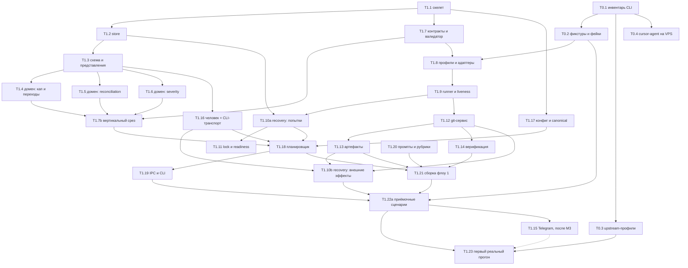

# Разбивка работ

Дата: 2026-08-04. Статус: декомпозиция фазы 1 готова к пакетному планированию;
Q44 и Q45 плана T1.5 закрыты владельцем; следствие Q45 для закрывающих решений
добавлено после контрольного ревью. Q46 плана T1.6 закрыт выбором одного human
gate с полным списком споров; контрольное ревью зафиксировало одно кампанийное
действие в ответе и точные DDL-ранги severity. Оценки не проверены реализацией.
Границы пакетов — §3.1, принятые развилки — §8.

Граф задач до первого работающего флоу, с зависимостями и критериями готовности.
Формат намеренно тот же, в котором система будет потреблять таск-планы: если он
неудобен человеку, он будет неудобен и агенту.

---

## 1. Принципы разбивки

**Задача — вертикальный срез с проверяемым результатом, а не слой.** «Написать
модели данных» — не задача: её результат нельзя проверить иначе, чем чтением.
«Схема + репозитории + тест, что принятый отказ не обнуляет накопитель severity» —
задача.

**Критерий готовности формулируется как тест, а не как состояние.** Не
«реализован планировщик», а «убийство сервиса на каждой из четырёх границ не
создаёт дублей и не теряет переходов».

**Размер — от половины дня до трёх.** Больше — значит внутри спрятан
неисследованный кусок, и его надо вынести отдельной задачей с явным риском.

**Порядок диктуется риском, а не удобством.** Сначала то, что может отменить
остальное: контракты вендорских CLI и протокол findings. Обвязка — потом,
она предсказуема.

**Оценки честные и непроверенные.** Это первый проход, кода нет, скорость
неизвестна. Числа нужны для порядка величин и относительного веса, а не для
плана-графика.

---

## 2. Рубежи

| Рубеж | Что означает | Проверяется |
|---|---|---|
| **M0** | Известно, как ведут себя вендорские CLI | Фикстуры сняты, фейковые CLI воспроизводят их байт в байт |
| **M1** | Протокол findings работает на чистой логике | Вся комбинаторика §14 `decision.md` проходит без единого процесса |
| **M1b** | Тот же протокол работает **на настоящей базе** | Вертикальный срез от слепых наблюдений до вопроса человеку, значения читаются из представлений |
| **M2** | Состояние переживает убийство | Kill на четырёх границах, recovery, continue |
| **M3** | Флоу «ревью коммита» проходит на фейковых CLI | Приёмочные сценарии зелёные |
| **M4** | Флоу «ревью коммита» проходит на реальных | Первый настоящий прогон |
| **M5** | MVP | Одна реальная задача проходит конвейер, результат не стыдно показать |

M1 — самый важный и самый недооценённый. Он достигается **до** того, как в
системе появится хоть один запущенный процесс, и именно он определяет, правильно
ли спроектирован протокол.

M1b добавлен после ревью схемы и стоит рядом не для симметрии: чистая логика
может быть верной, а её выражение в SQL — нет. Так и вышло с периодом накопления
severity, где текст описывал правило корректно, а запрос брал `MAX` вместо `MIN`.
Ошибка живёт на шве, и ловится она только исполнением на настоящей базе.

---

## 3. Граф

Критический путь: `T1.1 → T1.2 → T1.3 → T1.4/T1.5/T1.6 → T1.7b → T1.18 → T1.21
→ T1.22a → T1.23`. Всё остальное на него навешивается. Telegram (T1.15) вынесен
за M3 и на критическом пути не лежит — пунктирная связь означает «желателен к
первому реальному прогону, но не блокирует его».

### 3.1. Пакеты планирования и реализации

Отдельные таск-планы пишутся не на всю фазу 1 заранее, а **замкнутыми пакетами**.
Внутри пакета каждый план сначала пишется и ревьюится отдельно; реализация не
начинается, пока весь пакет не прошёл совместное ревью границ. Следующий пакет
планируется после реализации предыдущего и проверки его выходного рубежа: так
фактические интерфейсы не подменяются предположениями из далёкого плана.

| Пакет | Задачи | Вход | Выходной рубеж | Что проверяет совместное ревью |
|---|---|---|---|---|
| **P1-A · review core** | T1.1–T1.7 и T1.7b | M0 закрыт | **M1 + M1b:** findings-протокол проходит на чистой логике и настоящей SQLite без процессов агентов | Владение правилами между DDL, репозиториями, доменом и валидатором; единые типы/ID; транзакционная граница вертикального среза |
| **P1-B · process boundary** | T1.8, T1.9, T1.10a, T1.11 | P1-A | Процесс CLI управляем, liveness и recovery попыток проверены; readiness не обходит гашение сирот | Adapter outcome → attempt outcome; heartbeat и бюджеты; порядок recovery попыток/orphan kill → readiness; recovery audit внешних эффектов остаётся в P1-C |
| **P1-C · durable effects** | T1.12, T1.13, T1.14, T1.16, T1.10b | P1-A + P1-B | **M2:** git, артефакты, verification, human/outbox и их recovery переживают убийство | Intent/effect/compensate на каждом внешнем эффекте; digest/idempotency; атомарность вопроса и блокировки; единая политика reset/retry |
| **P1-D · orchestration** | T1.17–T1.22a | P1-A–P1-C | **M3:** флоу 1 и достижимые сценарии §14 проходят на fake CLI | Config → scheduler → IPC → flow; drift до запуска; hash промптов/рубрик; достижимость всех приёмочных сценариев без real vendor |
| **P1-E · real environment** | T1.23 и независимо T1.15 | M3 | **M4:** два стабильных real-CLI прогона; Telegram готов, если включён в пакет реализации | Fake/real parity, критерий останова притирки промптов, отсутствие зависимости домена от транспорта |

`T1.15` допускается планировать вместе с P1-E, но он не является входом T1.23 и
не блокирует M4. Фазы 2–3 пока остаются крупными блоками: их пакеты фиксируются
после M4, когда известны реальные интерфейсы и стоимость флоу 1.

Порядок работы с каждым пакетом повторяет контракт флоу 2 из `decision.md`
§11a:

1. планы пишутся по одному в топологическом порядке;
2. каждый план проходит отдельное ревью и исправление;
3. полный пакет проходит совместное ревью границ двумя последовательными
   кворумами со свежими проверяющими;
4. принятая версия пакета фиксируется одним baseline-коммитом;
5. задачи реализуются последовательно по графу, каждая со своим ревью;
6. изменение публичной границы уже принятого плана возвращает затронутые планы
   на ревью до продолжения реализации.

Фиксируются именно границы пакетов и их выходные рубежи, а не вечный состав:
если ревью обнаружит пропущенную задачу, её добавляют внутрь пакета явно и
повторяют совместную проверку.

---

## 4. Фаза 0: что делают вендорские CLI

Единственный настоящий внешний неизвестный (`decision.md` §15). Делается до
всего остального, потому что результат влияет на адаптеры, а не на стек — но
влияет сильно.

**Статус: завершена 2026-08-03 на Linux VPS.** Исходная суммарная оценка 3 дней,
факт — одна рабочая сессия (<1 дня) благодаря единому capture harness. Контракты
и ограничения записаны в `vendor-cli-contracts.md`, сырые ответы — в
`../../fixtures/vendor-cli/`.

### T0.1 · Инвентарь headless-контрактов · оценка 1 д, факт <0.5 д · **готово**

Для каждого из пяти профилей выяснить и записать: argv неинтерактивного запуска,
формат структурированного вывода, способ выделить финальный результат, коды
выхода и их значения, продолжение сессии, read-only режим, поведение при
SIGTERM.

**Готово, когда:** есть таблица на пять профилей, и в ней нет прочерков без
пометки «проверено, не поддерживается».

**Риск:** у какого-то CLI не окажется машинно выделяемого финального вывода.
Тогда для него — маркеры в промпте (`agent-contracts.md` §1.1) как основной путь,
а не как запасной.

**Факт:** четыре обязательных профиля имеют машинно выделяемый финал;
`cursor-agent` проверенно не установлен. Codex требует `turn.completed` в
добавление к exit 0, Claude — `result/success`. После ревью Claude fixtures
перезаписаны с изоляцией пользовательских MCP/skills/memory; S6 в `stream-json`
машинно подтверждает toolset `Glob/Grep/Read`.

### T0.2 · Фикстуры и фейковые CLI · оценка 1 д, факт <0.5 д · **готово**

Сырые ответы из T0.1 сохранить как фикстуры. Написать скрипты, которые по argv
находят фикстуру и печатают её в тот же формат с тем же кодом выхода. Плюс
намеренно битые режимы: невалидный JSON, молчание, вывод без завершения,
игнорирование SIGTERM.

**Готово, когда:** фейковый CLI неотличим от настоящего для кода адаптера, и
битые режимы включаются переменной окружения.

**Зачем отдельной задачей:** на этих фикстурах стоит вся Фаза 1. Сделанные
наспех, они дадут ложную зелень.

**Факт:** `fixtures/vendor-cli/fake-cli.py` воспроизводит оба потока и exit code;
режимы `broken_json`, `silent`, `no_finish`, `ignore_term`, `slow` проверены.
`broken_json` портит доменный payload внутри валидного vendor envelope;
дополнительный `malformed_stream` покрывает невалидный vendor JSON/JSONL.

### T0.3 · Профили через `ANTHROPIC_BASE_URL` · оценка 0.5 д, факт <0.5 д · **готово**

Проверить `claude-m` и `claude-z`: запускается ли `claude` с подменённым
base_url, что приходит в `actual_model` при запросе `opus`.

**Готово, когда:** для обоих профилей известна фактическая пара provider+model —
от неё зависит правило свежести ревьюера.

**Факт:** явный `--model opus` даёт MiniMax `MiniMax-M3` и Z.AI `glm-5.2`;
Anthropic даёт `claude-opus-5`. Самоописание GLM между probes расходилось,
поэтому источником истины назначен `system.init.model`.

### T0.4 · `cursor-agent` в headless на VPS · оценка 0.5 д, факт <0.5 д · **готово: недоступен**

`-p --output-format stream-json` по подписке, без браузера.

**Готово, когда:** ответ получен либо зафиксировано, что профиль недоступен.
Пятый профиль желателен, но v1 не блокирует.

**Факт:** бинарь отсутствует на VPS; все direct probes дают 127. Ничего не
устанавливалось и браузерная авторизация не запускалась.

---

## 5. Фаза 1: срез «ревью коммита»

### T1.1 · Скелет · 0.5 д

Python-пакет в `src/metaswarm`, явный setuptools discovery, `pyproject.toml` +
`uv.lock`, ruff, pytest и единый `scripts/check.sh`. Ничего лишнего: ни CI, ни
докера, ни pre-commit.

**Готово, когда:** `pytest` и `ruff` проходят на пустом проекте одной командой.

### T1.2 · Store: соединение, транзакции, события · 2 д

PRAGMA (все пять), выделенный поток-писатель с очередью, `transaction()` как
единственный способ записи, `run_event` append-only, миграция 0001 со схемой
целиком.

**Готово, когда:** попытка записать вне транзакции падает; попытка обновить
`run_event` падает на триггере; две конкурентные корутины не могут открыть
вложенную транзакцию; миграция `0001` применяется к пустому файлу целиком и
`PRAGMA foreign_key_check` не возвращает строк.

### T1.3 · Схема: репозитории и представления · 2 д

Репозитории по агрегатам, представления `campaign_counters`, `finding_period`,
`finding_severity`, `run_state`.

**Готово, когда:** зелены тесты на все инварианты с пометкой **База** и на
базовую половину инвариантов **База + код** (`db-schema.md` §10). Каждый —
попытка вставить нарушение и ожидание отказа. В том числе: `accepted_reason` с
`closes_severity_period = 1` не
вставляется; вторая связь на то же наблюдение не вставляется; вторая активная
попытка на шаг не вставляется; активная кампания с заполненным `closed_at` и
терминальная с `closed_at = NULL` не вставляются. Отдельная параметризованная
проверка проходит по всем child-колонкам закрытых enum'ов и подтверждает, что
неизвестное значение отвергается FK.

### T1.4 · Домен: кап и переходы · 2 д

`decide_after_check`, `decide_after_revision`, состояния кампании и круга,
причина остановки (`cap_exhausted_same` / `cap_exhausted_new`).

**Готово, когда:** таблично проверены обе границы капа — третья правка не
блокирует ветку до своей проверки, чистая четвёртая проверка не блокирует ветку
вовсе — и новое замечание на последнем круге не сбрасывает кап, а причина
читается как «новое». Если все оставшиеся отказы закрылись как `policy_closed`,
тот же круг получает `clean` и завершает кампанию без лишней авторской ревизии
или подтверждающей проверки; если другие findings открыты и бюджет остаётся,
результат круга — `needs_revision`, а при исчерпанном капе — `escalated`.

### T1.5 · Домен: reconciliation · 3 д

Склейка по `dedup_key` внутри круга, выдача личности, семь проверок валидации
(`agent-contracts.md` §4), четыре типа связи, двухшаговое переоткрытие
`human`-закрытого, роль `reconciler`. Один домен используется и для первичного
`discovery`, и для `new_observations`, найденных в последующих `fix_check`.
Завершённый первичный reconciliation заодно возвращает исход круга: `clean`
без работы автору либо `needs_revision` при её наличии; через
`decide_after_check` только этот первичный круг не идёт. Reconciliation внутри
`fix_check` дополняет open set до вызова T1.4 и делает
`cap_exhausted_new` достижимым. Follow-up observation внутри решения по уже
известному `finding_id` в T1.5 не входит: при `still_present`/`insists` его
механически связывает T1.7b после проверки finding/периода в T1.6; закрывающую
пару раньше отклоняет T1.7 (Q45).

**Готово, когда:** потерянное наблюдение, наблюдение в двух группах, ссылка на
закрытый ID в `existing_open`, `reopen_closed` без причины — каждое даёт
`contract_error` с внятным сообщением; сообщение содержит то, что нужно агенту
для исправления. `reaffirmed_closed` принимается только для закрытия через
`accepted_reason`; после `verified_fixed`, `policy_closed` и `human_decision`
тот же ID требует `reopen_closed`. Плюс: дословно совпавшие наблюдения
склеиваются ключом, разные
формулировки одной проблемы — не склеиваются и доходят до reconciliation;
`reopen_closed` на `human`-закрытом не входит в круг, а порождает вопрос, и
ответ мапится в `reopening` или `reaffirmation`, **причём круг всё это время не
двигается, а соседняя независимая ветка работает**; исчерпание
`contract_retry_budget` даёт вопрос человеку с сырыми наблюдениями круга, а не
механическую раскладку по новым ID. Отдельный тест проводит новый observation
четвёртого `fix_check` через reconciliation, выдаёт ему `first_round_id`
текущего круга и передаёт T1.4 как открытый finding.

### T1.6 · Домен: severity и периоды · 2 д

Разрешение цепочки `unchanged_from`, `severity_effective`, порог, три величины,
семантика `resolution_authority`/закрытия периода и полный набор одновременно
эскалируемых споров. Маршрутизация human-reopen принадлежит T1.5.

**Готово, когда:** проходит таблица границ периода из `db-schema.md` §5.6
целиком, включая три ключевых случая: `accepted_reason` не обнуляет накопитель, а
переоткрытие после него продолжает прежний период; после `verified_fixed` —
начинает новый; **понижение человеком действительно понижает** — наблюдения до
override в максимум не входят, а после override накопитель снова растёт. Плюс
follow-up observation с `unchanged_from` принимается только для того же finding
и текущего периода; другая личность или закрытый период дают contract error до
записи observation/link. Проверка периода применяется только после того, как
T1.7 подтвердил допустимую пару: follow-up есть лишь при
`still_present`/`insists`. Если несколько `insists` достигли порога, результат
содержит их все в порядке severity по убыванию, затем `finding_id`; ниже порога
получают `policy_closed` и в human snapshot не входят.

### T1.7 · Контракты и валидатор · 2 д

Разбор маркеров, Pydantic-схемы восьми ответов, включая обязательный массив
`new_observations` в `review.decisions.v1`, формирование сообщения об ошибке для
повторной попытки.

**Готово, когда:** каждая строка чек-листа `agent-contracts.md` §11 имеет тест с
битым входом; отдельно проверено, что новый observation fix-check не принимает
`finding_id`/`unchanged_from`, а пустой массив остаётся валидным. Follow-up
observation внутри `decisions[*]` сохраняет внешний target и не попадает в
адаптер T1.5; он допустим при `still_present`/`insists` и даёт
`contract_error` при `verified_fixed`/`accepted_reason`; `new_observations` не
могут использовать этот direct path.

### T1.7b · Вертикальный срез домена на реальной базе · 2 д

Один тонкий, но полностью исполняемый путь через `store` + `contracts` +
`domain`, **без единого запущенного процесса агента**: слепые наблюдения →
reconciliation → правка автора → `insists` с follow-up observation и
`unchanged_from` известного finding → direct `recurrence` → следующая правка →
решение ревьюера с новым observation на последнем `fix_check` → повторный
reconciliation → severity и кап → вопрос человеку `cap_exhausted_new`. Вход —
фикстуры ответов, выход — состояние в настоящем SQLite.

**Готово, когда:** сценарий проходит от начала до вопроса человеку, новый
finding имеет `first_round_id` последнего `fix_check`, причина вопроса равна
`cap_exhausted_new`, а все значения (`escalation_severity`, счётчики, статус
finding'а) читаются из базы через те же представления, что будет читать рантайм.
Follow-up observation и `recurrence` либо появляются вместе с решением, либо вся
транзакция откатывается; перед каждым `review_round.result` глобальный запрос
observations без link пуст. Отдельные негативные фикстуры доказывают, что
`verified_fixed`/`accepted_reason` с вложенным follow-up не оставляют в базе ни
решения, ни observation, ни link, ни resolution/event.

**Зачем отдельно от T1.4–T1.6.** Чистые функции домена недостаточны, и это
проверено на себе: логика периода накопления severity была правильно описана
текстом и **неправильно** реализована в SQL — `MAX` вместо `MIN`. Тест на чистой
функции такую ошибку не увидит, потому что ошибка живёт на шве между доменом и
представлением. Этот срез ловит именно швы, не требуя ни одного реального CLI.

### T1.8 · Профили и адаптеры · 3 д

Профиль как данные, сборка argv и env, три адаптера, `classify_exit` по кодам и
`result.subtype`.

**Готово, когда:** на фейковых CLI из T0.2 каждый исход попытки
(`succeeded`/`transient`/`contract_error`/`failed`) достигается воспроизводимо.

### T1.9 · Runner и liveness · 2 д

`create_subprocess_exec`, process group, чтение потоков, heartbeat, soft/hard
timeout по монотонным часам, TERM → grace → KILL.

**Готово, когда:** CLI, игнорирующий SIGTERM, гарантированно убит; молчащий
процесс даёт предупреждение по soft и `hung` по hard; `hang_retry_budget`
исчерпывается и уводит ветку к человеку, а не крутит петлю.

### T1.10a · Recovery: попытки и процессы · 2 д

`architecture.md` §4.5 целиком плюс пункты 2–4 из §4.6: перевод незавершённых
попыток в `interrupted`, поиск осиротевшего процесса по `METASWARM_ATTEMPT_ID` в
`/proc/*/environ`, гашение всех найденных групп, проверки полноты, перевод веток
в `awaiting_continue`. Гашение выполняется **до** readiness probe.

**Готово, когда:** убийство сервиса на четырёх границах (до запуска CLI, во
время, после завершения до фиксации, после фиксации до следующего шага) не даёт
ни дублей, ни потерянных переходов; осиротевший процесс погашен **до** создания
новой попытки — в том числе когда `attempt_liveness` записать не успели.

### T1.10b · Recovery: сверка внешних эффектов · 1.5 д

Пункт 1 из §4.6, отдельной задачей, потому что зависит от git и артефактов:
приведение ветки к `input_sha` прерванной авторской попытки, проверка artifact
repo по digest, дослать неотправленное из outbox.

**Готово, когда:** после падения между `git commit` и фиксацией состояния ветка
приходит в детерминированное состояние, а коммит прерванной попытки остаётся
достижим через reflog; повторная запись того же артефакта — no-op.

**Зависит от:** T1.12, T1.13, T1.16 (outbox с CLI-транспортом; Telegram здесь не
нужен — он добавляет второго отправителя, а не новый механизм). Отделено потому,
что T1.10a закрывается раньше и без них, а объявлять recovery готовым до
появления reconciler'ов внешних эффектов было бы неправдой.

### T1.11 · Instance lock и readiness · 1 д

`flock` + lease-файл, пять проверок readiness, `readiness.json`.

**Зависит от:** T1.10a. До readiness сервис обязан завершить recovery попыток и
погасить осиротевшие process groups; одного готового скелета для этой гарантии
недостаточно.

**Готово, когда:** второй экземпляр не стартует и сообщает, кто держит замок;
отсутствие бинаря профиля останавливает старт до создания первого гейта; **при
этом осиротевшие процессы уже погашены** — гашение идёт до readiness. Отдельный
тест: `/proc/*/environ` читается для собственных дочерних процессов; если нет —
и есть попытка без `attempt_liveness` — сервис отказывается стартовать.

### T1.12 · Git-сервис · 3 д

Disposable checkout на точном SHA, сверка tracked/untracked/index до и после,
checkpoint-коммит с `attempt_id` в сообщении, `input_sha`/`output_sha`, allowlist
операций.

**Готово, когда:** мутация ревьюера в любом из трёх мест аннулирует результат; на
рабочей ветке после падения и повтора остаётся **не более одного достижимого
checkpoint-коммита**, а отброшенный доступен только через reflog; запрещённых
операций нет в API, а не отклоняются проверкой.

### T1.13 · Артефакты и ревизии · 2 д

Запись сервисом, манифест, digest, ревизии, протухание апрувов.

**Готово, когда:** правка артефакта человеком даёт новую ревизию без апрувов;
повторная запись того же digest — no-op.

### T1.14 · Верификация · 3.5 д

`VerificationPlan`, policy check (пять правил), исполнение с per-step таймаутом,
env-скраббинг подпроцесса, `failure_signature`, baseline.

**Готово, когда:** план с shell-синтаксисом или `cwd` вне разрешённого
отклоняется и порождает вопрос человеку; развилка красного baseline из
`decision.md` §10 работает по обеим ветвям — «по той же причине» и «по другой»;
**зависший шаг убивается по `step_timeout_s`** и даёт сравнимую подпись
`timeout:<argv[0]>`; в окружении подпроцесса нет ни одной переменной сверх
allowlist — проверяется планом, который печатает своё окружение.

### T1.15 · Telegram · 3 д · **делается после M3**

Long polling, sender для `transport = 'telegram'`, идемпотентный inbox,
allowlist, кнопки. Транспортно-нейтральный outbox и CLI-транспорт уже существуют
с T1.16 — здесь добавляется второй отправитель, а не новый механизм.

**Готово, когда:** дублирующийся update обрабатывается один раз; неотправленное
из outbox уходит после рестарта; ответ на старый, чужой или уже закрытый вопрос
обрабатывается внятно, а не падает.

**Почему после M3:** протокол вопросов от транспорта не зависит, а long polling
за NAT — отдельная возня, которая не должна задерживать проверку review-протокола.

### T1.16 · Домен: человек в контуре + CLI-транспорт · 2 д

Формирование вопроса, стандартные варианты при исчерпании кругов, разбор ответа,
переспрос с лимитом, `awaiting_continue`. Транспортно-нейтральный
`notification_outbox` и отправитель `cli`, выдающий ожидающее по команде `ask`.
Для `dispute`/`cap_exhausted_*` свободный текст обязан свестись в одно
кампанийное действие; смешанная per-finding раскладка не применяется частично и
не снимает blocker, а запускает переспрос, после лимита — запрос ключа варианта.

Тест с **асинхронным фейковым транспортом** — здесь же, а не потом: доставка с
задержкой, дубль, потеря. Иначе домен незаметно обопрётся на синхронность CLI, и
это вскроется только при подключении Telegram.

**Готово, когда:** ответ записан до снятия блокировки; на место
`human_question` в той же транзакции встаёт `awaiting_continue`; соседняя ветка
всё это время работает, и `Run` остаётся `running`. Негативный тест с ответом
«F-12 принять, F-19 вернуть на правку» не создаёт `human_answer`, сохраняет
`human_question`/blocker открытыми и отправляет переспрос; после исчерпания
лимита принимается только один ключ.

### T1.17 · Конфиг и канонический вид · 2 д

Три уровня, Pydantic `extra="forbid"`, канонический JSON и hash, `validate`,
golden-тесты против ловушек YAML.

**Готово, когда:** неизвестное поле ломает загрузку; `on`/`yes` не становятся
булевыми молча; канонический вид совпадает с тем, что реально исполнено.

### T1.18 · Планировщик и drift check · 3 д

Событийный цикл, шесть проверок перед запуском, drift check по семи осям с
последствиями каждой.

**Готово, когда:** кворум с разными `rubric_hash` отклоняется **до** запуска;
принятый дрейф по code SHA обесценивает прежнее ревью; смена major вендорского
CLI не принимается флагом; **пара provider+model, авторившая ревизию, не
попадает в линии её проверки**, а конфиг флоу, где автор и ревьюер стадии
резолвятся в одну фактическую пару, не загружается вовсе; исчерпание бюджета
линии даёт вопрос с вариантом «продолжить деградированным кворумом», и факт
понижения сохраняется.

### T1.19 · IPC и CLI · 3 д

UDS-сервер, протокол команд, восемь команд, рендер дерева.

**Готово, когда:** `ask` показывает ждущее человека отдельно от работающего и
зависшего; `findings` показывает `escalation_severity` и `historical_max` рядом.

### T1.20 · Промпты и рубрики · 2 д

Для флоу 1: слепое обнаружение, reconciliation, dispositions, decisions,
формулировка вопроса. Подключение по `id + hash`. Основа — рубрики metaswarm.

**Готово, когда:** промпты лежат отдельными файлами, их hash попадает в манифест
попытки, а равенство `rubric_hash` между линиями проверяется до запуска.

### T1.21 · Сборка флоу 1 · 2 д

Шесть стадий из `decision.md` §11a в конфиге, связывание всего написанного.

**Готово, когда:** флоу проходит от baseline до финальной свежей кампании на
фейковых CLI.

### T1.22a · Приёмочные сценарии, достижимые в фазе 1 · 3 д

Сценарии `decision.md` §14, кроме тех, что требуют графа задач и переимпорта.

**Готово, когда:** зелёные. Это и есть M3.

Сценарии графа (цикл, висячая ссылка, ложный успех, принятый дрейф по ревизии
плана с переимпортом) переносятся в **T2.x** вместе с самим графом — прогнать их
раньше физически нечем. В первой редакции T1.22 обещала «все сценарии §14», и это
было невыполнимо по составу фазы.

### T1.23 · Первый реальный прогон · 3 д + буфер 3 д

Флоу 1 на настоящих CLI, на реальном коммите. Притирка промптов.

**Готово, когда:** прогон дошёл до конца **два раза подряд на разных коммитах**
без вмешательства в промпты между ними, и доля попыток с `contract_error` ниже
10%.

**Критерий останова здесь обязателен, и это единственная задача в плане, где
он не самоочевиден.** «Притирка промптов» — цикл без естественного конца: всегда
найдётся формулировка, которую можно улучшить. Отсюда числовой критерий выше и
отдельный буфер: если после шести дней доля контрактных ошибок не падает, это уже
не притирка, а сигнал, что схема ответа слишком сложна для моделей — и тогда
решение принимается отдельно, вплоть до упрощения контракта.

**Естественный первый подопытный — этот же репозиторий.** Ревью коммита
применимо к собственному коду сразу, материал под рукой, и качество findings
оценивается без домена-эксперта.

---

## 6. Фазы 2 и 3 — крупными блоками

Детализировать сейчас смысла нет: срез M4 изменит представление о том, что
дорого. Ориентиры из `decision.md` §16.

| Блок | Что входит | Оценка |
|---|---|---|
| Граф задач | Модуль `task_graph`, атомарный импорт, проверка цикла, `invalid_graph`, переимпорт по новой ревизии | 4–5 д |
| Приёмочные сценарии графа | Остаток `decision.md` §14: цикл, висячая ссылка, ложный успех, дрейф по ревизии плана | 1.5 д |
| Стадии дизайна | Тех-дизайн, ревью дизайна с двумя кворумами, обязательное утверждение человеком | 3–4 д |
| Таск-планы | По одному за раз, ревью каждого, ревью скопом с проверкой границ | 4–5 д |
| Реализация по графу | Последовательное исполнение, цикл исправлений на каждой задаче | 4–5 д |
| Финальная кампания | Несколько независимых кампаний с разными начальными проверяющими | 3 д |
| Файл заметок | Снимок в промптах, пополнение, прореживание отдельным коммитом | 2 д |
| Cut-off | Структурная проверка пяти секций, digest | 2 д |
| Инстанс СвойОрк | Второй instance profile, права на push, артефакты рядом с кодом | 2 д |
| Флоу 3 | Research, bootstrap, точки утверждения | 4–5 д |

Первым делать **РабОрк**: он строже по артефактам и git, и тем самым задаёт
безопасные умолчания. Ослабить их для СвойОрка — конфиг; ужесточить постфактум —
переделка.

---

## 7. Сводка объёма

| Фаза | Дней |
|---|---|
| Фаза 0 | <1 (факт, завершена) |
| Фаза 1 | 56.5 + буфер 3 на T1.23 |
| Фаза 2 (блоками) | 29.5–34.5 |
| **До MVP** | **~90–95 рабочих дней** |

Первая редакция заявляла 78–83, и это была арифметическая ошибка: сумма задач
фазы 1 составляла 53.5, а не 47. Дальше ревью добавило T1.7b, разделило T1.10 и
T1.22, добавило таймауты в T1.14 и буфер на притирку промптов. Числа
пересчитываются программно по заголовкам задач, а не вручную.

**Точка пересмотра — сразу после M3.** К этому моменту пройдено около двух
третей фазы 1 задачами разного размера, и появляется первое измерение реальной
скорости: фактические дни против оценённых. Оценка остатка умножается на
полученный коэффициент, и дальше в документе живут уже измеренные числа. Без
такой точки 90–95 застынет как обещание, хотя это была прикидка до написания
первой строки кода.

Ориентир `decision.md` §16 («~2–2.5 месяца») тем самым **не подтверждается**:
получается ближе к четырём месяцам чистого времени. Это стоит знать сейчас, а не
на середине. Причина расхождения не в раздувании объёма, а в том, что §16 давал
оценку до детализации, по ощущению от масштаба.

Заметно больше половины фазы 1 — протокол findings и всё вокруг него: T1.3–T1.7b
плюс T1.22a.

Оценки — от одного человека с агентской поддержкой, при неизвестной скорости.
Уверенность в самой арифметике полная, в календарном смысле — низкая, пока не
пройдены M0 и первый исполнимый DDL. Их назначение — показать **относительный
вес**: если реализация reconciliation займёт полдня, это повод перепроверить, все
ли семь проверок написаны, а не радоваться опережению.

---

## 8. Принятые решения по развилкам

### 8.1. Транспорт вопросов: CLI сначала — **решено**

Telegram (T1.15) уходит за M3. Домен создаёт `human_question` и блокировку,
`notification_outbox` транспортно-нейтрален, отправитель `cli` выдаёт ожидающее
командой `ask`.

Условие, без которого это решение вредно: **тест с асинхронным фейковым
транспортом пишется сразу**, в T1.16 — с задержкой доставки, дублем и потерей.
Иначе домен привыкнет к синхронности CLI, и это вскроется только при подключении
Telegram, то есть на месяц позже.

### 8.2. Профили: три личности для M3, три-четыре для M4

Уточнено против первой редакции. «Профиль» здесь — не человек и не подписка, а
**строка конфигурации: какой бинарь, с каким бэкендом, под какой моделью**
(`decision.md` §9.1). Их пять:

| Профиль | Бинарь | Куда ходит |
|---|---|---|
| `claude` | `claude` | Anthropic по подписке |
| `claude-m` | `claude` | MiniMax через `ANTHROPIC_BASE_URL` |
| `claude-z` | `claude` | Z.AI GLM через `ANTHROPIC_BASE_URL` |
| `codex` | `codex` | OpenAI по подписке |
| `cursor-agent` | `cursor-agent` | Cursor |

Три верхние строки — **один и тот же бинарь**, отличаются только бэкендом:
подменяется базовый URL, и за словом «opus» оказывается другая модель. Отсюда всё
правило свежести: считать надо по фактической паре provider+model, а не по имени
профиля.

Сколько нужно:

- **M3 (фейковые CLI): три различные фактические личности, не две.** Начальная
  кампания флоу 1 — две линии, финальная свежая — третья. На чистом пути ревизия
  не менялась, поэтому закрыть финальную кем-то из первых двух нельзя.
- **M4 (реальные CLI): трёх различных provider+model достаточно** для флоу 1;
  readiness probe при этом проверяет все объявленные в конфиге профили.
- **Четыре одновременно** нужны не здесь, а на стадиях флоу 2 с двумя
  последовательными кворумами по две линии.

Проверить на T0.3 заранее: если `claude-m` и `claude-z` резолвятся в одну
фактическую модель, независимых мнений три, а не четыре, — и допущение
`decision.md` §15 пересматривается до начала работ, а не после.

### 8.3. Порядок внутри фазы 1: домен, но с вертикальным срезом на реальной базе

Гибрид вместо «чистого домена». T1.3–T1.7 остаются как были, но за ними идёт
**T1.7b** — исполняемый путь через store + contracts + domain на настоящем
SQLite, без единого процесса агента. И только после него — полная комбинаторика
и обвязка.

Довод против первоначального «только чистые функции» оказался эмпирическим:
логика периода накопления severity была правильно описана текстом и неправильно
реализована в SQL. Тест чистой функции такую ошибку не ловит — она живёт на шве
между доменом и представлением. Стоимость гибрида — два дня; цена пропуска —
ошибка в накопителе severity, обнаруженная на интеграции.

---

## 9. Шаблон таск-плана

Канонический копируемый шаблон —
[`../task-plans/TEMPLATE.md`](../task-plans/TEMPLATE.md). Это формат, в котором
пишутся планы дальше — и человеком, и агентом на стадии 6 флоу 2. Второй,
«облегчённый» шаблон не заводится.

У плана обязательны: точные baseline SHA кода и проектных документов из
artifact repo; цель и наблюдаемый результат; границы и non-goals; входы с
потребляемыми результатами; публичные контракты с единственным владельцем и
потребителями; инварианты и отказные сценарии; изменения по файлам; порядок
реализации; атомарные критерии приёмки; проверки с явным соответствием
критериям; риски, допущения и отсутствие открытых вопросов. Раздел не
удаляется, если ответ — «нет»: явное отсутствие отличимо от забытого анализа.

Критерии приёмки обязаны быть проверяемы без участия автора плана и описывать
поведение: не «реализовано», а «при X происходит Y». Автоматические проверки
пишутся как `cwd` + argv-массив без shell-синтаксиса, в том же виде, который
затем принимает `verification.plan.v1` (`agent-contracts.md` §7); для ручной
`inspection` вместо argv фиксируются точное действие и ожидаемое свидетельство.

Открытый вопрос записывается в черновике, ветка останавливается, а черновик
передаётся человеку вместо содержательного ревью. После ответа автор обновляет
затронутые разделы и явно пишет «открытых вопросов нет»; только тогда начинается
ревью плана. Контракт findings и правила остановки ветки нельзя подменить
допущением автора; для изменений остальных публичных границ действует правило
возврата на ревью из §3.1.
