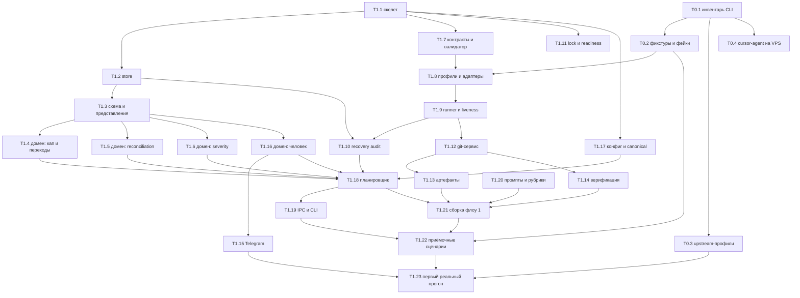

# Разбивка работ

Дата: 2026-08-02. Статус: **предложение**, требует утверждения. Развилки — §8.

Граф задач до первого работающего флоу, с зависимостями и критериями готовности.
Формат намеренно тот же, в котором система будет потреблять таск-планы: если он
неудобен человеку, он будет неудобен и агенту.

---

## 1. Принципы разбивки

**Задача — вертикальный срез с проверяемым результатом, а не слой.** «Написать
модели данных» — не задача: её результат нельзя проверить иначе, чем чтением.
«Схема + репозитории + тест, что принятый отказ не обнуляет накопитель severity» —
задача.

**Критерий готовности формулируется как тест, а не как состояние.** Не
«реализован планировщик», а «убийство сервиса на каждой из четырёх границ не
создаёт дублей и не теряет переходов».

**Размер — от половины дня до трёх.** Больше — значит внутри спрятан
неисследованный кусок, и его надо вынести отдельной задачей с явным риском.

**Порядок диктуется риском, а не удобством.** Сначала то, что может отменить
остальное: контракты вендорских CLI и протокол findings. Обвязка — потом,
она предсказуема.

**Оценки честные и непроверенные.** Это первый проход, кода нет, скорость
неизвестна. Числа нужны для порядка величин и относительного веса, а не для
плана-графика.

---

## 2. Рубежи

| Рубеж | Что означает | Проверяется |
|---|---|---|
| **M0** | Известно, как ведут себя вендорские CLI | Фикстуры сняты, фейковые CLI воспроизводят их байт в байт |
| **M1** | Протокол findings работает на чистой логике | Вся комбинаторика §14 `decision.md` проходит без единого процесса |
| **M2** | Состояние переживает убийство | Kill на четырёх границах, recovery, continue |
| **M3** | Флоу «ревью коммита» проходит на фейковых CLI | Приёмочные сценарии зелёные |
| **M4** | Флоу «ревью коммита» проходит на реальных | Первый настоящий прогон |
| **M5** | MVP | Одна реальная задача проходит конвейер, результат не стыдно показать |

M1 — самый важный и самый недооценённый. Он достигается **до** того, как в
системе появится хоть один запущенный процесс, и именно он определяет, правильно
ли спроектирован протокол.

---

## 3. Граф



Критический путь: `T1.1 → T1.2 → T1.3 → T1.4/T1.5/T1.6 → T1.18 → T1.21 → T1.22
→ T1.23`. Всё остальное на него навешивается.

---

## 4. Фаза 0: что делают вендорские CLI

Единственный настоящий внешний неизвестный (`decision.md` §15). Делается до
всего остального, потому что результат влияет на адаптеры, а не на стек — но
влияет сильно.

### T0.1 · Инвентарь headless-контрактов · 1 д

Для каждого из пяти профилей выяснить и записать: argv неинтерактивного запуска,
формат структурированного вывода, способ выделить финальный результат, коды
выхода и их значения, продолжение сессии, read-only режим, поведение при
SIGTERM.

**Готово, когда:** есть таблица на пять профилей, и в ней нет прочерков без
пометки «проверено, не поддерживается».

**Риск:** у какого-то CLI не окажется машинно выделяемого финального вывода.
Тогда для него — маркеры в промпте (`agent-contracts.md` §1.1) как основной путь,
а не как запасной.

### T0.2 · Фикстуры и фейковые CLI · 1 д

Сырые ответы из T0.1 сохранить как фикстуры. Написать скрипты, которые по argv
находят фикстуру и печатают её в тот же формат с тем же кодом выхода. Плюс
намеренно битые режимы: невалидный JSON, молчание, вывод без завершения,
игнорирование SIGTERM.

**Готово, когда:** фейковый CLI неотличим от настоящего для кода адаптера, и
битые режимы включаются переменной окружения.

**Зачем отдельной задачей:** на этих фикстурах стоит вся Фаза 1. Сделанные
наспех, они дадут ложную зелень.

### T0.3 · Профили через `ANTHROPIC_BASE_URL` · 0.5 д

Проверить `claude-m` и `claude-z`: запускается ли `claude` с подменённым
base_url, что приходит в `actual_model` при запросе `opus`.

**Готово, когда:** для обоих профилей известна фактическая пара provider+model —
от неё зависит правило свежести ревьюера.

### T0.4 · `cursor-agent` в headless на VPS · 0.5 д

`-p --output-format stream-json` по подписке, без браузера.

**Готово, когда:** ответ получен либо зафиксировано, что профиль недоступен.
Пятый профиль желателен, но v1 не блокирует.

---

## 5. Фаза 1: срез «ревью коммита»

### T1.1 · Скелет · 0.5 д

Пакет, зависимости, ruff, pytest, один скрипт запуска проверок. Ничего лишнего:
ни CI, ни докера, ни pre-commit.

**Готово, когда:** `pytest` и `ruff` проходят на пустом проекте одной командой.

### T1.2 · Store: соединение, транзакции, события · 2 д

PRAGMA (все пять), выделенный поток-писатель с очередью, `transaction()` как
единственный способ записи, `run_event` append-only, миграция 0001 со схемой
целиком.

**Готово, когда:** попытка записать вне транзакции падает; попытка обновить
`run_event` падает на триггере; две конкурентные корутины не могут открыть
вложенную транзакцию.

### T1.3 · Схема: репозитории и представления · 2 д

Репозитории по агрегатам, представления `campaign_counters`, `finding_period`,
`finding_severity`, `run_state`.

**Готово, когда:** зелены тесты на инварианты, которые держит база
(`db-schema.md` §10, 12 штук). Каждый — попытка вставить нарушение и ожидание
отказа. В том числе: `accepted_reason` с `closes_severity_period = 1` не
вставляется; вторая связь на то же наблюдение не вставляется; вторая активная
попытка на шаг не вставляется.

### T1.4 · Домен: кап и переходы · 2 д

`decide_after_check`, `decide_after_revision`, состояния кампании и круга,
причина остановки (`cap_exhausted_same` / `cap_exhausted_new`).

**Готово, когда:** таблично проверены обе границы капа — третья правка не
блокирует ветку до своей проверки, чистая четвёртая проверка не блокирует ветку
вовсе — и новое замечание на последнем круге не сбрасывает кап, а причина
читается как «новое».

### T1.5 · Домен: reconciliation · 3 д

Склейка по `dedup_key` внутри круга, выдача личности, семь проверок валидации
(`agent-contracts.md` §4), четыре типа связи.

**Готово, когда:** потерянное наблюдение, наблюдение в двух группах, ссылка на
закрытый ID в `existing_open`, `reopen_closed` без причины — каждое даёт
`contract_error` с внятным сообщением; сообщение содержит то, что нужно агенту
для исправления.

### T1.6 · Домен: severity и периоды · 2 д

Разрешение цепочки `unchanged_from`, `severity_effective`, порог, три величины,
`resolution_authority`, маршрутизация `reopen_closed`.

**Готово, когда:** проходит таблица границ периода из `decision.md` §6.3
целиком, включая ключевой случай — `accepted_reason` не обнуляет накопитель, а
переоткрытие после него продолжает прежний период; после `verified_fixed` —
начинает новый.

### T1.7 · Контракты и валидатор · 2 д

Разбор маркеров, Pydantic-схемы восьми ответов, формирование сообщения об ошибке
для повторной попытки.

**Готово, когда:** каждая строка чек-листа `agent-contracts.md` §11 имеет тест с
битым входом.

### T1.8 · Профили и адаптеры · 3 д

Профиль как данные, сборка argv и env, три адаптера, `classify_exit` по кодам и
`result.subtype`.

**Готово, когда:** на фейковых CLI из T0.2 каждый исход попытки
(`succeeded`/`transient`/`contract_error`/`failed`) достигается воспроизводимо.

### T1.9 · Runner и liveness · 2 д

`create_subprocess_exec`, process group, чтение потоков, heartbeat, soft/hard
timeout по монотонным часам, TERM → grace → KILL.

**Готово, когда:** CLI, игнорирующий SIGTERM, гарантированно убит; молчащий
процесс даёт предупреждение по soft и `hung` по hard; `hang_retry_budget`
исчерпывается и уводит ветку к человеку, а не крутит петлю.

### T1.10 · Recovery audit · 2 д

Пять шагов из `architecture.md` §4.5.

**Готово, когда:** убийство сервиса на четырёх границах (до запуска CLI, во
время, после завершения до фиксации, после фиксации до следующего шага) не даёт
ни дублей, ни потерянных переходов; осиротевший процесс погашен **до** создания
новой попытки.

### T1.11 · Instance lock и readiness · 1 д

`flock` + lease-файл, пять проверок readiness, `readiness.json`.

**Готово, когда:** второй экземпляр не стартует и сообщает, кто держит замок;
отсутствие бинаря профиля останавливает старт до создания первого гейта.

### T1.12 · Git-сервис · 3 д

Disposable checkout на точном SHA, сверка tracked/untracked/index до и после,
checkpoint-коммит с `attempt_id` в сообщении, `input_sha`/`output_sha`, allowlist
операций.

**Готово, когда:** мутация ревьюера в любом из трёх мест аннулирует результат;
повторный checkpoint после падения не создаёт второго коммита с тем же
содержимым; запрещённых операций нет в API, а не отклоняются проверкой.

### T1.13 · Артефакты и ревизии · 2 д

Запись сервисом, манифест, digest, ревизии, протухание апрувов.

**Готово, когда:** правка артефакта человеком даёт новую ревизию без апрувов;
повторная запись того же digest — no-op.

### T1.14 · Верификация · 3 д

`VerificationPlan`, policy check (пять правил), исполнение, `failure_signature`,
baseline.

**Готово, когда:** план с shell-синтаксисом или `cwd` вне разрешённого
отклоняется и порождает вопрос человеку; развилка красного baseline из
`decision.md` §10 работает по обеим ветвям — «по той же причине» и «по другой».

### T1.15 · Telegram · 3 д

Long polling, outbox sender, идемпотентный inbox, allowlist, кнопки.

**Готово, когда:** дублирующийся update обрабатывается один раз; неотправленное
из outbox уходит после рестарта; ответ на старый, чужой или уже закрытый вопрос
обрабатывается внятно, а не падает.

### T1.16 · Домен: человек в контуре · 2 д

Формирование вопроса, стандартные варианты при исчерпании кругов, разбор ответа,
переспрос с лимитом, `awaiting_continue`.

**Готово, когда:** ответ записан до снятия блокировки; на место
`human_question` в той же транзакции встаёт `awaiting_continue`; соседняя ветка
всё это время работает, и `Run` остаётся `running`.

### T1.17 · Конфиг и канонический вид · 2 д

Три уровня, Pydantic `extra="forbid"`, канонический JSON и hash, `validate`,
golden-тесты против ловушек YAML.

**Готово, когда:** неизвестное поле ломает загрузку; `on`/`yes` не становятся
булевыми молча; канонический вид совпадает с тем, что реально исполнено.

### T1.18 · Планировщик и drift check · 3 д

Событийный цикл, шесть проверок перед запуском, drift check по семи осям с
последствиями каждой.

**Готово, когда:** кворум с разными `rubric_hash` отклоняется **до** запуска;
принятый дрейф по code SHA обесценивает прежнее ревью; смена major вендорского
CLI не принимается флагом.

### T1.19 · IPC и CLI · 3 д

UDS-сервер, протокол команд, восемь команд, рендер дерева.

**Готово, когда:** `ask` показывает ждущее человека отдельно от работающего и
зависшего; `findings` показывает `escalation_severity` и `historical_max` рядом.

### T1.20 · Промпты и рубрики · 2 д

Для флоу 1: слепое обнаружение, reconciliation, dispositions, decisions,
формулировка вопроса. Подключение по `id + hash`. Основа — рубрики metaswarm.

**Готово, когда:** промпты лежат отдельными файлами, их hash попадает в манифест
попытки, а равенство `rubric_hash` между линиями проверяется до запуска.

### T1.21 · Сборка флоу 1 · 2 д

Шесть стадий из `decision.md` §11a в конфиге, связывание всего написанного.

**Готово, когда:** флоу проходит от baseline до финальной свежей кампании на
фейковых CLI.

### T1.22 · Приёмочные сценарии · 4 д

Все сценарии `decision.md` §14 на фейковых CLI.

**Готово, когда:** зелёные. Это и есть M3.

### T1.23 · Первый реальный прогон · 3 д

Флоу 1 на настоящих CLI, на реальном коммите. Притирка промптов.

**Готово, когда:** прогон дошёл до конца, и разбор транскриптов не выявил мест,
где модель систематически не понимает контракт.

**Естественный первый подопытный — этот же репозиторий.** Ревью коммита
применимо к собственному коду сразу, материал под рукой, и качество findings
оценивается без домена-эксперта.

---

## 6. Фазы 2 и 3 — крупными блоками

Детализировать сейчас смысла нет: срез M4 изменит представление о том, что
дорого. Ориентиры из `decision.md` §16.

| Блок | Что входит | Оценка |
|---|---|---|
| Граф задач | Модуль `task_graph`, атомарный импорт, проверка цикла, `invalid_graph`, переимпорт по новой ревизии | 4–5 д |
| Стадии дизайна | Тех-дизайн, ревью дизайна с двумя кворумами, обязательное утверждение человеком | 3–4 д |
| Таск-планы | По одному за раз, ревью каждого, ревью скопом с проверкой границ | 4–5 д |
| Реализация по графу | Последовательное исполнение, цикл исправлений на каждой задаче | 4–5 д |
| Финальная кампания | Несколько независимых кампаний с разными начальными проверяющими | 3 д |
| Файл заметок | Снимок в промптах, пополнение, прореживание отдельным коммитом | 2 д |
| Cut-off | Структурная проверка пяти секций, digest | 2 д |
| Инстанс СвойОрк | Второй instance profile, права на push, артефакты рядом с кодом | 2 д |
| Флоу 3 | Research, bootstrap, точки утверждения | 4–5 д |

Первым делать **РабОрк**: он строже по артефактам и git, и тем самым задаёт
безопасные умолчания. Ослабить их для СвойОрка — конфиг; ужесточить постфактум —
переделка.

---

## 7. Сводка объёма

| Фаза | Дней |
|---|---|
| Фаза 0 | 3 |
| Фаза 1 | 47 |
| Фаза 2 (блоками) | 28–33 |
| **До MVP** | **~78–83 рабочих дня** |

Соответствует ориентиру `decision.md` §16: дешёвая обвязка — недели, дорогое
ядро — основная часть. Заметно больше половины Фазы 1 — это протокол findings и
всё, что вокруг него: T1.3–T1.7 плюс T1.22.

Оценки — от одного человека с агентской поддержкой, при неизвестной скорости.
Их назначение — показать **относительный вес**: если реализация reconciliation
займёт полдня, это повод перепроверить, все ли семь проверок написаны, а не
радоваться опережению.

---

## 8. Что требует твоего решения

Три развилки. По каждой есть рекомендация, но выбор твой.

### 8.1. Транспорт вопросов в Фазе 1: Telegram сразу или CLI сначала

**Рекомендую CLI сначала.** Протокол вопросов от транспорта не зависит: домен
создаёт `human_question`, ставит блокировку, ждёт `human_answer`. Команды `ask` и
`answer` закрывают это на второй день, а Telegram (T1.15, 3 дня плюс отладка
long polling за NAT) переносится ближе к T1.23, где он реально нужен — когда
прогоны станут долгими и ты перестанешь сидеть у терминала.

Против: outbox и идемпотентность входящих проектируются под Telegram, и если
делать их позже, есть риск, что домен незаметно обопрётся на синхронность CLI.
Смягчается тем, что таблицы outbox и inbox уже в схеме — писать надо только
отправитель и поллер.

### 8.2. Сколько профилей в первом прогоне

**Рекомендую два обязательных для M3, четыре для M4.** Кворум из двух линий —
минимум, на котором работает reconciliation и правило владельца. Четыре нужны для
финальной свежей кампании: она требует участника, не видевшего ревизию, а после
двух кворумов по две линии свободных пар не остаётся.

Это стоит проверить на T0.3 заранее: если `claude-m` и `claude-z` резолвятся в
одну и ту же фактическую модель, независимых мнений будет три, а не четыре — и
допущение `decision.md` §15 придётся пересматривать до, а не после.

### 8.3. Порядок внутри Фазы 1: домен целиком или тонкий вертикальный срез

**Рекомендую домен целиком (T1.3–T1.7) до всякой обвязки.** Это M1, и он
достигается без единого запущенного процесса. Довод: протокол findings — то
единственное, чего нет готового ни у кого, и ошибка в нём стоит переделки всего
остального. Проверить его на чистых функциях можно за неделю; проверить его же
через интеграционные прогоны — за месяц.

Против: месяц без единого сквозного запуска, и первое соприкосновение с реальными
CLI случается поздно. Отчасти это снимает Фаза 0 — она даёт фикстуры и уверенность
в контрактах до начала.

---

## 9. Шаблон таск-плана

Формат, в котором пишутся планы дальше — и человеком, и агентом на стадии 6
флоу 2. Проверяется структурно, как cut-off.

```markdown
## <ID> · <название>

**Цель.** Одна фраза: что появится в системе.

**Не входит.** Что рядом, но делается отдельно. Явный список важнее полного.

**Входные условия.** Какие задачи закрыты, какие артефакты существуют.

**Состав работ.**
- конкретные файлы и модули
- какие таблицы, какие функции

**Готово, когда.** Проверяемые утверждения, каждое — тест или наблюдаемое
поведение. Не «реализовано», а «при X происходит Y».

**Риск.** Что может пойти не так и что тогда делать.

**Оценка.** Дни.
```

Секция «Готово, когда» — единственная обязательно непустая, и её содержимое
обязано быть проверяемым без участия автора плана. Всё остальное может быть
коротким. Причина та же, что у критерия приёмки cut-off: план, из которого
непонятно, как убедиться в готовности, порождает круг ревью с претензией «не
сделано», на которую нечего ответить.
