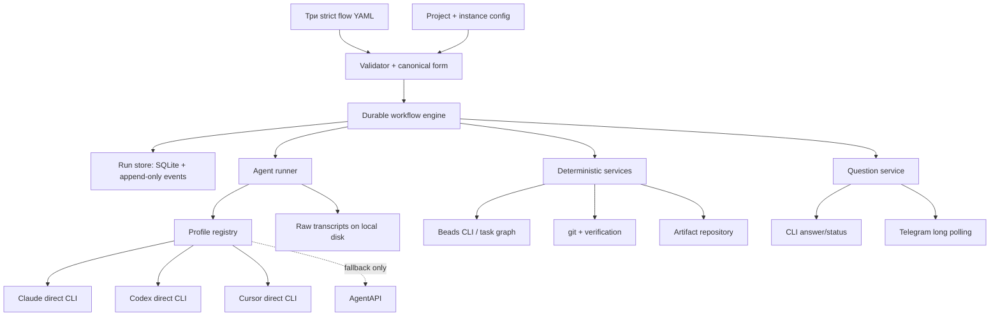

# Мета-ресёрч Codex: из чего собирать stable-metaswarm

Дата проверки: 2026-08-01.

Это уже не пересказ README. В документ сведены все материалы из
`docs/researches/` (`fable.md`, `gemini.md`, `glm.md`, `opus.md`, `qwen.md`,
`sol.md`), ответы из `docs/requirements/open-questions.md` и повторная проверка
архитектурно значимых утверждений по исходникам в `refs/`. Точные коммиты — в
`refs/pinned.tsv`; выводы ниже относятся именно к ним.

Правило доказательств: решения в пользу основы и code donor проверены по
исполняемым моделям/веткам кода, а не по обещаниям README. Для кандидатов,
которые исключаются уже из-за несовместимого product shape или собственного
статуса `deprecated`/`sunsetting`, достаточно self-description из закреплённого
репозитория; это явно видно в матрице. Ссылка вида `path:120-135` означает строки
в pinned checkout, а не текущий `main` проекта.

## Короткий ответ

Полностью готового оркестратора под наши требования **нет**. Ближе всех по
модели управления — Microsoft Conductor, но его встроенные provider'ы работают
через SDK/API, а нам нужны подписочные CLI. Ближе всех по предметной модели
ревью — VirtusLab Orca, но его persistence привязан к коммитам в репозитории с
кодом, а исчерпание review-loop не останавливает ветку. Ближе всех по
операционной оболочке — Forge и Gas City, но оба приносят чужую модель задач и
слишком большой для нашей последовательной v1 контур.

Рекомендуемый путь:

1. Взять **Microsoft Conductor как кодовую основу управляющего ядра**: строгую
   схему flow, детерминированный routing, context modes, parallel review lanes,
   `script`/`human_gate`, validation, event log и resume.
2. Сделать сфокусированный форк/derivative, а не зависеть от Conductor как от
   чёрного ящика. Заменить SDK-oriented provider layer на собственный
   **profile-driven direct CLI runner**.
3. Использовать **Beads как отдельный готовый task-graph store через CLI**, без
   форка и без попытки сделать его runtime'ом всего прогона.
4. Перенести предметные контракты review/fix из **VirtusLab Orca** и
   процессные промпты/рубрики из **metaswarm**, но написать собственную
   state machine findings: `fixed | rejected | wont_fix`, проверка отказа,
   три правки автора и затем durable human escalation.
5. Использовать **Bernstein как проверенный каталог реализаций запуска
   Claude/Codex/Cursor и Telegram long polling**, но не тащить его целиком:
   адаптеры тесно связаны с `.sdd`, worktree и небезопасными для нас default'ами.
6. Оставить **AgentAPI только PTY-fallback** для CLI, у которого нет стабильного
   headless/structured режима. Для Claude, Codex и Cursor он не должен стоять на
   основном пути.
7. Писать на **Python 3.12+**. Это позволяет повторно использовать код и модели
   Conductor/Bernstein, даёт простой `asyncio.subprocess`, Pydantic и Telegram
   bot library. Go/Rust/Scala здесь увеличат стоимость стыковки без выигрыша в
   нужной нам семантике.

Итого рекомендуемая сборка:

> **Conductor-derived Python core + Beads CLI + собственные direct CLI
> profiles + собственный review domain + Telegram bridge.**

Это не самый короткий путь до красивой демонстрации. Это самый короткий путь до
системы, которая действительно соблюдает уже принятые правила и не потребует
через месяц вынимать state machine из чужого task manager или GUI-продукта.

Развилка в одном экране:

| Путь | Что получится быстро | Что случится на полном наборе требований | Вердикт |
|---|---|---|---|
| Запустить Forge или VirtusLab Orca почти как есть | Демонстрация agent→review/CI за дни | Придётся менять task/artifact lifecycle, HITL, exhaustion и persistence; ранняя работа станет выбрасываемой | Только прототип/сверка UX |
| Достроить Gas City + Beads | Быстро получим task graph, providers и quorum fan-out | Настоящий revision loop, Telegram, strict flow и artifact policy всё равно свои, но внутри большого чужого operational stack | Не выбирать сейчас |
| Focused Conductor derivative | За 1–2 недели — честный `review-commit` vertical slice | Недостающие части совпадают с нашими естественными boundary: CLI provider, RunStore, question/review domain | **Выбранный путь** |
| Написать весь engine с нуля | Полный контроль с первого дня | Повторно напишем routing, context, validation, checkpoints и eventing; ориентир дольше выбранного пути на несколько недель | Fallback, если spike отвергнет Conductor |

## 1. Что именно выбираем с учётом ответов

Архитектуру определяют не общие слова «multi-agent», а следующие уже закрытые
решения из `open-questions.md`:

- две независимые POSIX-инсталляции: РабОрк в WSL2 и СвойОрк на VPS; нативная
  Windows — только клиент (`open-questions.md:228-280`);
- один активный run и один проект, реализация в РабОрке последовательная
  (`open-questions.md:495-508`, `:685-723`);
- агентские процессы запускаются напрямую и неинтерактивно; PTY допустим только
  как fallback (`open-questions.md:326-367`);
- интерфейс v1 — CLI и двусторонний Telegram long polling, без web UI
  (`open-questions.md:910-984`, `:1515-1538`);
- открытый вопрос ждёт сколько угодно, блокирует только зависимую ветку и не
  вызывает автоматическое решение (`open-questions.md:957-1017`);
- reviewer строго read-only; его мутация делает review недействительным
  (`open-questions.md:1095-1115`);
- обязательны профили `codex`, `claude`, `claude-m`, `claude-z`, желателен
  `cursor-agent`; это пять профилей, но только три CLI adapter'а
  (`open-questions.md:1117-1251`);
- недоступный vendor повторяется N раз, затем run ждёт человека; подмена модели
  запрещена (`open-questions.md:1268-1287`);
- каждый finding обязан закончиться как `fixed`, `rejected` или `wont_fix`, а
  отказ проверяет reviewer (`open-questions.md:724-753`);
- три круга означают три исправления автора и до четырёх review; исчерпание
  останавливает только ветку (`open-questions.md:808-843`);
- состояние переживает завершение процесса и машины, но возобновление только по
  явной `continue`; прерванный step считается проваленным и запускается новой
  попыткой (`open-questions.md:1585-1622`);
- flow-конструктор общего назначения не нужен: сначала три вылизанных flow,
  строгий parser и показ canonical form (`open-questions.md:1643-1669`);
- РабОрк не пишет служебные артефакты в репозиторий кода; они живут в отдельном
  auxiliary repo и всегда ссылаются на точный code SHA
  (`open-questions.md:574-666`);
- raw transcripts лежат на диске, не в git; verification result и выбранный
  рецепт — структурированные артефакты (`open-questions.md:1310-1403`,
  `:1540-1583`).

Остальные принятые ограничения также остаются частью решения, хотя меньше
влияют на выбор базового проекта: окружение и логины подготавливает человек;
контейнеров по умолчанию нет; пользователь один; стек проекта неизвестен и
verification берётся из project config; бюджет токенов не считается; запрещены
production/чужие среды, выход за workspace, чтение секретов и force-push;
РабОрк может публиковать только task branch, а PR в master создаёт человек;
prompts и artifacts пишутся по-английски, Telegram — по-русски
(`open-questions.md:59-110`). Эти правила должны быть безопасными default'ами
instance/profile config, а не условностями в одном flow.

Эти ответы сразу исключают как основную платформу продукты, чья главная ценность
— web/desktop UI, обязательный tmux, постоянные worktree или многопользовательская
параллельная диспетчеризация.

### Решения по трём отложенным вопросам

Выбор основы позволяет закрыть их без отдельной архитектурной развилки:

| Вопрос | Рекомендация | Почему |
|---|---|---|
| Q0: одна или две системы | **Одна кодовая база, два instance profile** | Дорогая часть — review protocol, recovery и CLI adapters — одинакова. Отличаются только artifact placement, git publication policy и позже worktree strategy. |
| Q10 для СвойОрка | **Последовательно в первой версии** | Так ведёт себя РабОрк, это уже покрывает первый MVP и не требует merge scheduler. Worktree executor добавляется отдельной стратегией после трёх flow. |
| Q30: код, CLI или API | **Детерминированное — код/CLI service; суждение — agent CLI** | Git, Beads, verification, retry, timeout, checkpoints, Telegram и artifact writes не должны зависеть от решения LLM. API провайдера не используем там, где требуется подписочный CLI. |

## 2. Главные поправки к предварительным выводам

Ниже перечислены не мелкие неточности, а утверждения, которые меняют выбор
основы. Они отменяют соответствующие более ранние выводы в `docs/researches/`
и часть слишком оптимистичных формулировок в
`docs/analysis/claims-to-verify.md`.

### 2.1. Gas City `max_attempts = 3` — не наш review/fix loop

`mol-review-quorum` действительно запускает две read-only lane и затем
synthesis (`refs/gascity/internal/bootstrap/packs/core/formulas/mol-review-quorum.toml:59-185`).
Но сама формула прямо называет себя scaffold и говорит, что synthesis пока
выполняет агент, а готовый Go finalizer не подключён (`:1-11`, `:179-183`).

Главное: `RetrySpec.max_attempts` — **общее число infrastructure attempts,
включая первую**, с исходом `hard_fail | soft_fail`
(`refs/gascity/internal/formula/types.go:705-712`). Это повтор упавшего reviewer
или synthesis, а не последовательность:

`review(A1) → fix(A2) → review(A2) → ... → human`.

У формулы нет автора, revision, disposition findings, проверки отказа и
эскалации после трёх исправлений. Поэтому claim C1 из
`claims-to-verify.md:26-50` подтверждает наличие quorum/retry, но **не
подтверждает готовность нужного нам цикла**.

### 2.2. Telegram в Gas City — не «только конфиг»

HTTP adapter умеет отправить `PublishRequest` внешнему процессу, но raw inbound
у него намеренно не реализован: внешний bridge должен сам проверить,
нормализовать и отправить сообщение обратно в API
(`refs/gascity/internal/extmsg/http_adapter.go:21-23`, `:49-77`). Значит,
Telegram bridge — небольшой, но реальный код с хранением binding/correlation,
а не одна запись в конфиге.

### 2.3. Beads даёт durable block, но не готовый human channel

В модели Beads действительно есть gate fields, включая `human`, timeout и
waiters (`refs/beads/internal/types/types.go:142-146`). `bd gate create`
создаёт отдельный bead и `blocks` dependency, а закрывается вручную через
`bd gate resolve` (`refs/beads/cmd/bd/gate.go:345-401`). Это полезный и готовый
durable primitive.

Но автоматический evaluator обрабатывает только `gh:run`, `gh:pr`, `timer` и
`bead`; веток `human` и `mail` в нём нет
(`refs/beads/cmd/bd/gate.go:651-667`). Timer по дизайну закрывается и **никогда
не эскалирует** (`:943-957`). Отдельный `bd human respond` требует обычный issue
с label `human`, добавляет комментарий и закрывает его
(`refs/beads/cmd/bd/human.go:184-194`, `:243-263`); gate при создании этот label
не получает автоматически.

Следовательно, Beads не надо форкать, но поверх него нужны question service,
Telegram delivery, связь ответа с gate и явный `continue`.

### 2.4. CAO стал durable, но всё ещё нарушает правило direct CLI first

В закреплённом CAO уже есть сильный workflow journal: Python flow поддерживает
ветвления/loops/fan-out, replay проверяет детерминизм, а resume возвращает
готовые step results и выполняет остаток
(`refs/cao/docs/workflows.md:3-18`, `:55-73`, `:213-220`). Старые оценки,
сводившие CAO только к supervisor API, устарели.

Однако исполнение provider'ов по-прежнему требует tmux (`refs/cao/README.md:14-32`):
prompt отправляется keystroke'ами, результат получается через
`capture-pane` и provider-specific regex
(`refs/cao/src/cli_agent_orchestrator/services/agent_step.py:402-430`). Это
именно fallback-механизм, который требования запрещают делать обязательным.
Telegram transport в коде также отсутствует. Поэтому CAO — источник идей для
journal/replay tests, не runtime v1.

### 2.5. Conductor заметно ближе к требованиям, чем считалось

У него уже есть детерминированный routing без LLM в управляющем цикле,
parallel/subworkflow/script/set/terminate/human gate и preflight validation
(`refs/conductor-ms/README.md:10-32`). Context modes `accumulate`, `last_only`,
`explicit` прямо покрывают наши stage policies и cut-off
(`refs/conductor-ms/docs/configuration.md:519-560`). CLI human gate принимает
choice и дополнительный free text (`refs/conductor-ms/docs/cli-reference.md:274-310`).

Checkpoint хранит workflow hash, входы, текущий step, context, limits, session
IDs, run ID и event-log path (`refs/conductor-ms/src/conductor/engine/checkpoint.py:76-139`).
То есть управляющая state machine и resume уже реальны. Недостатки — checkpoint
по умолчанию лежит в `$TMPDIR` (`:142-159`), gate response привязан к dashboard
HTTP, а список provider'ов жёстко ограничен SDK-oriented вариантами
(`refs/conductor-ms/src/conductor/config/schema.py:693-708`). Это локальные,
хотя и не совсем маленькие, точки переделки.

### 2.6. Bernstein — сильный parts bin, но не готовый durable workflow

Его manifest runner умеет command/agent/loop, но `interactive` прямо помечен как
stub и отвергается при загрузке
(`refs/bernstein/src/bernstein/core/workflows/workflow_spec.py:91-124`). Сам run
создаёт новый ID и собирает результаты в памяти; в этом коде нет восстановления
cursor после рестарта
(`refs/bernstein/src/bernstein/core/workflows/workflow_runner.py:180-250`).
Широкий audit/replay Bernstein не превращает этот конкретный flow runner в
durable engine.

Зато direct adapters практически полезны:

- Codex запускается как `codex exec --sandbox workspace-write --json`, умеет
  OAuth login и process watchdog
  (`refs/bernstein/src/bernstein/adapters/codex.py:79-160`);
- Cursor — как `cursor-agent -p --output-format stream-json`, read-only через
  `--mode ask`, auth через OAuth или secret env
  (`refs/bernstein/src/bernstein/adapters/cursor.py:59-178`);
- Claude обрабатывает stream-json, liveness/session logs и role tool lists
  (`refs/bernstein/src/bernstein/adapters/claude.py:273-316`, `:388-500`).

Код нельзя переносить вслепую: Claude adapter включает automatic fallback и
`bypassPermissions`, а также одновременно заявляет continuation и передаёт
`--no-session-persistence` (`:291-302`, `:405-408`, `:477-494`). Это
противоречит нашим правилам «без подмены» и сохранения сессии. Все пути логов
также зашиты в `.sdd` внутри code workspace. Нужны извлечение механики и новые
безопасные defaults, а не импорт пакета целиком.

Telegram driver реален и использует long polling
(`refs/bernstein/src/bernstein/core/chat/drivers/telegram.py:1-27`), но inbound
обрабатывает slash commands и approve/reject callback, не произвольный текст
(`:213-260`). Добавить обычный message handler и durable correlation всё равно
придётся.

### 2.7. VirtusLab Orca имеет лучший review loop, но неверный terminal outcome

Orca действительно предоставляет `reviewAndFixLoop`, параллельных reviewers,
structured `FixOutcome` и длительную coder session
(`refs/orca-virtuslab/flow/src/main/scala/orca/review/ReviewLoop.scala:190-250`).
Это лучший найденный исполняемый образец предметного цикла.

Но после `maxIterations` открытые findings превращаются в `IgnoredIssues`, и
flow продолжает работу; cap считает fixes, поэтому evaluations может быть
`maxIterations + 1` (`:25-68`). Это противоположно нашему «поставить ветку и
спросить человека». Кроме того, resume основан на progress-файле, который
коммитится вместе с кодом (`refs/orca-virtuslab/README.md:99-142`), что
неприемлемо для РабОрка. Из Orca следует переносить domain model, prompts и
тестовые сценарии, но не lifecycle целиком.

## 3. Результат по всем проектам

Оценка ниже относится к нашей задаче, а не к качеству проектов вообще.

| Проект | Что подтверждено кодом | Роль в stable-metaswarm | Решение |
|---|---|---|---|
| **microsoft/conductor** | Strict Pydantic schema, deterministic routes, context modes, parallel steps, human gate, checkpoints/resume, JSONL events (`refs/conductor-ms/README.md:10-32`) | Управляющее ядро и основа flow schema | **Взять сфокусированным форком/derivative** |
| **gastownhall/beads** | Durable dependency graph, `Metadata` extension point (`refs/beads/internal/types/types.go:93-102`), gate bead, manual resolve | Source of truth для task graph и связи task↔artifact↔review | **Использовать как внешний CLI**, не форкать |
| **dsifry/metaswarm** | Глубокие роли, рубрики, no-anchoring, cap/escalation — но parallel state machine записана как `Promise.all` внутри Markdown (`refs/metaswarm/skills/design-review-gate/SKILL.md:23-54`) | Prompt/rubric/process library | **Перенести и адаптировать контент** |
| **VirtusLab/orca** | Исполняемый typed review/fix loop, structured findings/outcomes, parallel reviewers, session continuity | Эталон review domain и набор тестовых сценариев | **Портировать идеи/контракты**, не брать lifecycle |
| **sipyourdrink-ltd/bernstein** | Direct Claude/Codex/Cursor adapters, process watchdog, session logs, Telegram long polling | Источник кода для adapter/Telegram слоя | **Выборочно адаптировать с attribution** |
| **gastownhall/gascity** | Beads-native formulas, provider profiles, durable messaging fabric, quorum fan-out/finalizer | Источник схем profile/output и integration patterns | **Не брать как основу**; точечно сверяться |
| **ForgeAILab/forge** | Rust single binary, SQLite, direct adapters, task lifecycle, CI/review/human gates, retry budgets | Запасной полноценный control plane | **Plan B**, если приоритет сместится к worktree/web |
| **awslabs/cli-agent-orchestrator** | Durable deterministic Python journal и resume, но provider execution через tmux/TUI | Источник replay semantics и fault tests | **Не использовать runtime/adapters** |
| **coder/agentapi** | Единый HTTP facade для многих CLI и status/events (`refs/agentapi/README.md:1-3`, `:82-87`), построенный поверх terminal emulation (`:147-181`) | PTY fallback для неподдерживаемого headless CLI | **Опциональная зависимость**, не основной путь |
| **gastownhall/gastown** | Beads, formulas, mail, watchdog chain и worktree agents (`refs/gastown/README.md:66-108`); полноценный режим требует tmux (`:131-136`) | Набор operational patterns для далёкой parallel версии | **Не брать**: tmux/worktree/20–30 agents — чужая задача |
| **stoneforge-ai/stoneforge** | Event-sourced SQLite+JSONL, tasks, resumable playbooks, worktree workers (`refs/stoneforge/README.md:61-92`) | Возможный источник идей audit/task views | **Не брать**: early-stage, рассчитан на 3–5 agents и сознательно не имеет human gates (`:32-44`) |
| **stablyai/orca** | Desktop IDE, terminal/worktree management, mobile companion, широкий CLI catalog (`refs/orca-stably/README.md:19-65`, `:171-205`) | Возможный будущий UI-клиент | **Не брать в v1**: UI/worktree product, не flow engine |
| **tutti-os/tutti** | Shared realtime GUI workspace и app ecosystem (`refs/tutti/README.md:40-68`, `:74-110`) | Ничего обязательного для target runtime | **Не брать**: macOS-first GUI, Windows/VM ещё заявлены как будущие (`:24-38`) |
| **BloopAI/vibe-kanban** | Kanban/web workspace, agents, branches, inline diff review | Никакой надёжной основы на будущее | **Исключить**: проект объявил sunset (`README.md:18-20`) |
| **humanlayer/humanlayer** | Закреплённый repo сам говорит, что код почти весь deprecated | Нет | **Исключить** (`README.md:1-3`) |

### Почему не Gas City + Beads, хотя это выглядело главным фаворитом

У этого варианта сильные стороны: Beads-native state, широкий provider catalog
(`refs/gascity/internal/worker/builtin/profiles.go:96-100`), durable external
messaging и уже написанные формулы. Но для наших требований придётся всё равно
писать:

- настоящий author↔reviewer revision loop;
- findings/dispositions и проверку отказа;
- human question delivery/correlation;
- Telegram bridge;
- строгий canonical parser для нашего flow surface;
- artifact placement вне code repo;
- нужные manual-resume semantics.

При этом мы наследуем большой Go-контур Gas Town/Gas City, pack lifecycle и
операционные сущности, нужные прежде всего многим параллельным агентам. Формулы
также не полностью strict: код отдельно предупреждает, что неизвестные TOML
tables/JSON fields обычно молча отбрасываются
(`refs/gascity/internal/formula/types.go:40-45`). Это прямо конфликтует с Q40.
Цена адаптации оказывается выше, чем цена добавить Beads adapter в более
подходящий flow engine.

### Почему не Forge

Forge — наиболее серьёзный Plan B. Он уже запускает Claude, Codex, Cursor и
другие CLI, хранит состояние в SQLite, имеет audit log и CI/review/human gate
(`refs/forge/README.md:16-39`). Его model содержит gate state и
`requires_user_approval` (`refs/forge/crates/api-types/src/workflow.rs:142-200`),
а exhaustion обычного gate budget действительно блокирует task
(`refs/forge/crates/services/src/workflow/actions/gates.rs:78-177`).

Но единица мира Forge — task в обязательном isolated worktree с lifecycle до
merge. Наша единица — artifact/revision/review campaign поверх последовательного
конвейера и внешнего Beads graph. Чтобы получить её в Forge, пришлось бы:

- либо отказаться от Beads и продублировать исходное требование;
- либо синхронизировать два task store;
- добавить несколько типов artifact review, quorum и dispositions;
- отключить worktree/merge-first assumptions;
- добавить Telegram и отдельный auxiliary artifact repo.

Кроме того, сам проект — public beta 0.1.x, а workflow engine ещё назван одним
из условий будущего 1.0 (`refs/forge/README.md:114-120`). Forge стоит вернуть в
shortlist, если СвойОрку раньше времени понадобятся параллельные реализации,
web UI и автоматический merge queue. Сейчас это лишняя платформа вокруг
нехватающего нам ядра.

### Почему не Temporal, Prefect, LangGraph, ControlFlow или DBOS

Эти варианты появились в `fable.md`, `gemini.md` и `qwen.md` как способ получить
durability/HITL. После проверки Conductor и Beads отдельный general-purpose
durable engine для v1 не оправдан:

- у нас один пользователь и один run, нет distributed workers;
- решения требуют явного manual `continue`, а не автоматического workflow
  scheduling;
- Beads уже хранит task dependencies и durable blocks;
- Conductor уже даёт cursor/checkpoint/resume и deterministic routing;
- внешний engine добавит deployment, worker/API auth и ещё один state model,
  но не даст наших findings/dispositions или CLI profiles.

LangGraph/ControlFlow дополнительно тянут нас к API/model clients, тогда как
Q1b/Q27a требуют существующие подписочные CLI. Их можно пересмотреть только при
появлении распределённого исполнения или многих одновременных runs.

## 4. Целевая архитектура

### 4.1. Управляющее ядро

Оставляем из Conductor:

- загрузку и строгую Pydantic validation (`extra="forbid"` уже стоит и на
  step, и на workflow: `refs/conductor-ms/src/conductor/config/schema.py:653-685`,
  `:2430-2435`);
- ordered conditional routes;
- parallel groups для quorum, но не для параллельной реализации РабОрка;
- `script`, `set`, `terminate`, `human_gate`, subworkflow;
- context modes и explicit inputs;
- output schema validation;
- event subscriber и checkpoint/resume logic;
- workflow source hash и защиту от resume по изменившемуся flow.

Каждая из трёх flow-конфигураций явно задаёт role→profile, quorum size,
infrastructure retry, correction cap (default 3), context policy и обязательные
human approval stages; по умолчанию обязательное утверждение только у
tech-design. Эти значения вычисляет parser, а не выбирает orchestrator agent по
ходу run.

Переделываем:

- `AgentProvider` → `CliAdapter` + `Profile`. Существующий интерфейс уже
  нормализует execute/output/capabilities
  (`refs/conductor-ms/src/conductor/providers/base.py:166-275`), поэтому engine
  не надо переписывать целиком;
- provider enum/registry — с четырёх жёстких значений на adapter registry;
- checkpoint backend — из `$TMPDIR` в configurable durable `RunStore`;
- `human_gate` — из dashboard callback в независимый `QuestionService`, которым
  одинаково пользуются CLI и Telegram;
- status model — отдельные `running`, `waiting_human`, `retry_wait`, `hung`,
  `paused`, `failed`, `succeeded`;
- resume — только явная команда; никакого запуска следующего step сразу после
  Telegram answer.

Не переносим в MVP dashboard, Copilot SDK, Anthropic API provider, ACA sandbox и
cost budget. Их лучше удалить или сделать extras, чтобы production path нельзя
было случайно направить в API вместо подписочного CLI.

### 4.2. Хранилища и единственный владелец каждого факта

Один общий store здесь был бы не упрощением, а смешением разных жизненных
циклов. Нужны чёткие границы:

| Данные | Владелец | Что хранится |
|---|---|---|
| Граф задач | **Beads в artifact workspace** | task, dependency, готовность, link на run/stage/artifact, human gate для блокировки task |
| Курсор исполнения | **RunStore (SQLite)** | run, step, immutable attempt, logical session, retry counter, heartbeat, question, checkpoint, terminal reason |
| История переходов | **append-only `run_event` в той же SQLite** | state transition и idempotency key в одной транзакции |
| Код | **git clone проекта** | branch, commits, exact code SHA, diff |
| Проверяемые документы | **artifact repo** | design, task plans, cut-off, review JSON, verification JSON, notes, manifest |
| Полные разговоры | **локальный transcript dir** | raw stdout/stderr/stream-json; в RunStore только path, digest и redacted summary |

SQLite достаточно: система локальная, writer один, параллельны только reviewer
lane. Не нужен отдельный server. WAL, foreign keys, schema migrations и
transaction `state change + event` дадут надёжную основу для CLI status и
recovery. Beads не дублирует runtime cursor, а RunStore не пытается вычислять
готовность task graph.

Transcript retention задаётся числом завершённых runs, не временем. Active,
paused и `waiting_human` runs сборщик никогда не удаляет; committed artifacts и
их provenance от очистки локальных raw logs не зависят.

Минимальные собственные сущности:

- `Run` и `StageExecution`;
- immutable `StepAttempt` и `AgentInvocation`;
- `LogicalSession` с vendor-native session ID;
- `ArtifactRef` с content digest и code/artifact SHA;
- `ReviewCampaign`, `ReviewRound`, `ReviewerLane`;
- `Finding` и `FindingDisposition`;
- `VerificationRun` и baseline relation;
- `HumanQuestion`/`HumanAnswer`;
- `RunEvent`.

На старте процесса recovery audit переводит оставшиеся `running` attempts в
`failed(interrupted)`. `continue` создаёт новый attempt. Старый result никогда
не перезаписывается. Внешние эффекты не бывают магически exactly-once, поэтому
git/Beads/Telegram service используют стабильный idempotency key
`run_id/step_id/attempt_id` и умеют reconcile состояние после падения между
вызовом и commit транзакции.

### 4.3. Beads adapter

Beads запускается только через его публичный CLI с JSON output. Не импортируем
Go internals и не форкаем schema. Adapter отвечает за:

- создание task graph из утверждённого design;
- stable metadata namespace `stable_metaswarm.*`;
- links на artifact IDs, campaign/round и code SHA;
- создание `bd gate --type human` для конкретного заблокированного task;
- ручной `bd gate resolve` после durable записи ответа;
- reconciliation: open gate без pending question и наоборот считается
  ошибкой состояния, а не молча исправляется.

Не используем `Waiters` как Telegram delivery и не задаём timeout для human
gate: по требованиям вопрос ждёт бесконечно. `bd human` можно оставить человеку
как дополнительный CLI view, но он не является протоколом ответа runtime.

### 4.4. Direct CLI adapter и profile

Adapter описывает механику конкретной программы:

- как проверить установку/auth;
- как сформировать argv без shell interpolation;
- как передать prompt и working directory;
- как включить headless structured output;
- как получить/возобновить session ID;
- как определить activity/completion/rate limit;
- как применить read-only policy;
- как мягко и затем жёстко остановить process group;
- как классифицировать `transient`, `hard`, `timeout`, `contract_error`,
  `mutation_violation`.

Profile — данные поверх adapter: executable/wrapper, requested model/tier,
фактические provider/model identity, flags, разрешённые env names и ссылки на
secrets. Разделение requested и actual обязательно: `opus` в `claude-m` и
`claude-z` означает разные модели, а независимость мнений считается по
фактической паре provider+model. Поэтому v1 выглядит так:

| Profile | Adapter | Отличие |
|---|---|---|
| `claude` | `claude` | Обычный Claude Code login/model |
| `claude-m` | `claude` | MiniMax wrapper/base URL/model/env mapping |
| `claude-z` | `claude` | Z.AI GLM wrapper/base URL/model/env mapping |
| `codex` | `codex` | Codex login/model/reasoning/sandbox |
| `cursor-agent` | `cursor` | Cursor login/model/mode; желательный профиль |

Role в flow ссылается только на profile. Vendor outage не меняет profile и не
выбирает fallback. Retry infrastructure invocation считается отдельно от
review correction round.

Для транскриптов сначала фильтруются известные secret values и чувствительные
env/argv. Сам конфиг содержит только `secret_ref`, никогда token. Redaction —
defence in depth: секреты также не передаются модели, если adapter без них
работает через локальную login session.

Общий policy preamble и provider hooks запрещают production/чужие среды,
выход за workspace, чтение secret paths и force-push; deterministic git service
отдельно не предоставляет запрещённых операций. Это соответствует принятому
уровню защиты «prompts + wrappers»: мы не называем его hard sandbox и не
добавляем контейнеры только ради красивого security claim.

### 4.5. Reviewer read-only

Один prompt «ничего не меняй» недостаточен. Нужны три слоя:

1. provider-native read-only: Codex read-only sandbox, Claude tool allowlist без
   write tools, Cursor `--mode ask`;
2. reviewer работает по зафиксированному code/artifact SHA в отдельном
   disposable checkout/worktree, а output возвращает через stdout — писать в
   artifact repo будет runtime;
3. before/after snapshot проверяет tracked, untracked и index state. Любая
   reviewer-created mutation даёт `mutation_violation`; review result не
   участвует в quorum, checkout удаляется, invocation повторяется или
   эскалируется.

Verification commands выполняет service step, а reviewer читает их immutable
result. Так reviewer не нужен write-capable shell только ради build artifacts.

### 4.6. Предметный review protocol

Это главная часть, которой нет готовой ни в одном проекте:

1. Author создаёт revision `A1` и immutable artifact/code SHA.
2. Настроенное число reviewer lane проверяет одну и ту же revision параллельно.
3. Каждый finding получает stable ID, severity, evidence и origin lane.
4. Author обязан отнести каждый finding ровно к одному исходу:
   `fixed`, `rejected`, `wont_fix`.
5. Reviewer lane проверяет и исправление, и аргумент отказа. Незакрытый или
   потерянный finding остаётся open.
6. Существенный спор выше configured severity threshold сразу создаёт
   `HumanQuestion`; мелкий принятый отказ закрывается с audit trail.
7. Внутри одной campaign reviewer lane продолжает собственную logical session и
   помнит прежний круг. Новая campaign/quorum получает новые session IDs.
8. После максимум трёх author corrections проводится до четырёх reviews. Если
   findings остались, только эта ветка переходит в `waiting_human`.
9. Human answer может разрешить, потребовать ещё исправление, принять риск или
   остановить ветку. Продолжение всё равно запускается отдельной CLI-командой.
10. Run успешен только когда все tasks закрыты, final campaign не имеет
    unresolved findings и verification зелёный.

Из Orca берём принцип exhaustive `FixOutcome` и сохранение coder session. Из
metaswarm — роли, rubrics, explicit escalation и no-anchoring для новой
campaign. Не берём Orca `IgnoredIssues` как terminal success и не считаем
Gas City infrastructure retry review round'ом.

### 4.7. Telegram и human questions

`QuestionService` — transport-agnostic. Он сначала атомарно сохраняет question,
затем outbox worker доставляет его в Telegram. Long polling сохраняет
`update_id`, принимает:

- inline option callback;
- короткую команду с question ID;
- свободный текст как reply на конкретное bot message.

Schema question хранит blocking subject, формулировку по-русски, варианты с
confidence/recommendation и полный контекст для решения. Короткий ответ `A`/`B`
разрешается кодом без отдельного LLM; свободный текст сохраняется дословно и
интерпретируется только следующим явно заданным step, если это вообще нужно.

Ответ сначала сохраняется с unique Telegram message/update ID, затем question
помечается answered и связанный Beads gate закрывается. Повторный update
идемпотентен. Неоднозначный свободный текст не прикрепляется к «последнему
вопросу» молча — bot просит ответить reply или указать ID.

У РабОрка и СвойОрка отдельные bot token и instance ID: независимые long-poll
process не должны делить один update stream. Каждый instance принимает команды
только от configured Telegram user/chat allowlist, а сообщение всегда содержит
короткий instance/run/question ID, чтобы ответ нельзя было случайно отправить в
другую систему.

И CLI, и Telegram вызывают один application service. В v1 Telegram отправляет
вопросы/critical notifications, но не пытается быть status dashboard. Статусы —
CLI, как решено в Q36.

### 4.8. Артефакты и project notes

Artifact writer — детерминированный service, не право произвольного agent step:

- РабОрк пишет только в auxiliary artifact repo; code clone остаётся чистым от
  служебных файлов;
- СвойОрк использует configured соседний path;
- каждый artifact manifest содержит `run_id`, `stage_id`, attempt/profile,
  input refs, exact code SHA, content digest и schema version;
- сырые transcripts не коммитятся, но manifest содержит их local ref/digest;
- outgoing agent пишет standalone cut-off по строгой schema;
- следующий stage получает контекст по policy `task_only`,
  `task_and_artifacts`, `cutoff`, `resume_own_session`;
- project notes автоматически добавляются во все prompts; verification stage
  обязан предложить append, а финальный maintenance step делает thinning под
  configured cap.

Verification recipe остаётся текстом в project config. Если там уже есть
точные команды, service выполняет их напрямую. Если написано «проверь сам» или
описан результат человеческим языком, verification-planner agent возвращает
структурированный `VerificationPlan`; runtime проверяет cwd/argv против policy
и только затем сам исполняет команды. И plan, и result сохраняются. По
возможности тот же resolved plan запускается до изменения как baseline, чтобы
отделить старый красный тест от новой регрессии.

### 4.9. Конкретный технологический набор

| Задача | Выбор для v1 | Комментарий |
|---|---|---|
| Runtime | Python 3.12+, `asyncio` | Это baseline Conductor (`refs/conductor-ms/pyproject.toml:1-6`) и естественная среда для direct subprocess/Telegram |
| Config | Pydantic v2 + `ruamel.yaml` | Берём strict models и нормализацию Conductor; unknown fields запрещены |
| Templates/routes | Jinja2 + ограниченный expression evaluator | Только deterministic data routing; никаких LLM-решений о следующем step |
| CLI | Typer + Rich | Уже используются Conductor; достаточно для `run/status/continue/pause/cancel/answer/validate` |
| Durable control state | stdlib `sqlite3`, WAL, numbered SQL migrations | Без отдельного server и ORM; транзакции и запросы статуса важнее универсального persistence abstraction |
| Processes | `asyncio.create_subprocess_exec`, process groups | Никакого shell-built argv; liveness, TERM→grace→KILL и raw stream capture |
| Telegram | `python-telegram-bot` как optional extra | Bernstein подтверждает рабочий long-poll path; business state остаётся в нашем RunStore |
| Project operations | внешние `git` и `bd` с JSON output | Adapter/service boundary, idempotency и явная проверка exit/result schema |
| Tests | pytest, fake CLI executables, golden fixtures, fault injection | Реальные vendor smoke tests идут отдельным opt-in suite |
| Packaging | `uv` lock/tool install либо обычный wheel | Одинаково для WSL2 и VPS; установка и login остаются ручными |

Conductor уже зависит от Typer, Rich, Pydantic, `ruamel.yaml`, Jinja2 и
`simpleeval` (`refs/conductor-ms/pyproject.toml:33-46`), поэтому этот выбор
сохраняет проверенный слой и одновременно позволяет убрать из обязательной
установки Copilot/Anthropic SDK, FastAPI, Uvicorn и web dashboard. В v1 также не
нужны tmux, Docker, Redis, Postgres, message broker и отдельный workflow server.

### 4.10. Процессная модель

Асинхронность «поставил и ушёл» и Telegram long polling требуют процесса,
который не привязан к открытому terminal. На каждом instance работает ровно
один `stable-metaswarm serve` под `systemd --user` (или в foreground под другим
явно настроенным process supervisor). Он — единственный writer RunStore и
владелец agent child processes.

Локальный CLI общается с ним через Unix domain socket; наружу TCP/web endpoint
не открывается. `run` ставит запрос, `status` читает состояние,
`pause/cancel/answer/continue` посылают команды. Перезапуск daemon выполняет
recovery audit и возобновляет Telegram polling, но **не продолжает workflow**:
прерванный attempt становится failed, run остаётся paused до явного
`continue`. Если WSL2 или VPS были выключены, Telegram updates дочитаются по
сохранённому offset после запуска service.

## 5. Что уже готово, что делается за дни, что займёт недели

### Уже готово и можно переиспользовать

«Готово» здесь означает готовый компонент, а не готовую интегрированную систему.

| Компонент | Источник | Как используем |
|---|---|---|
| Strict flow parsing и canonical model | Conductor | Сохраняем Pydantic models/validator; добавляем `show-canonical` и source hash |
| Deterministic routing, parallel groups, context modes | Conductor | Основа трёх flow и quorum |
| Checkpoint payload и resume semantics | Conductor | Сохраняем модель, меняем persistence/backend policy |
| Task dependency graph | Beads | Готовый внешний CLI/store |
| Durable blocking gate | Beads | Готовое состояние блокировки; transport пишем сами |
| Review/fix contracts и tests | VirtusLab Orca | Портируем domain invariants, не Scala runtime |
| Роли, rubrics, prompts | metaswarm | Версионируем как prompt pack на английском |
| Direct argv/output patterns | Bernstein | Адаптируем Claude/Codex/Cursor механики |
| Telegram long-poll skeleton | Bernstein | Портируем lifecycle/outbound/buttons, добавляем free text/outbox |
| Optional PTY facade | AgentAPI | Подключаем только через отдельный fallback adapter |
| Provider/profile vocabulary | Gas City | Используем как проверочный образец capabilities/options, не runtime dependency |

Лицензии выбранных доноров permissive: Conductor, Beads, metaswarm и AgentAPI —
MIT; VirtusLab Orca и Bernstein — Apache-2.0. При переносе файлов/существенных
фрагментов сохраняем copyright/license notices и отдельно отмечаем provenance.

### Небольшие доработки: ориентир в рабочих днях

Оценки даны для одного разработчика с помощью агентов, после короткого
ознакомления с кодом. Работы можно частично вести параллельно.

| Работа | Оценка | Результат |
|---|---:|---|
| Поднять focused Conductor fork, убрать необязательные SDK/web extras | 1–3 дня | Минимальный CLI package и upstream provenance |
| Single-writer daemon, Unix socket и `systemd --user` unit | 2–4 дня | Run/Telegram не зависят от открытого terminal; сетевого API нет |
| `RunStore` interface + SQLite schema + перенести checkpoint path | 3–5 дней | State переживает restart; status query работает |
| Общий `CliAdapter`/`Profile` contract и fake adapter | 2–4 дня | Можно тестировать engine без реальных vendors |
| Codex direct adapter | 1–3 дня | JSON stream, session/output, timeout, read-only |
| Claude adapter + два wrapper profile | 2–4 дня | `claude`, `claude-m`, `claude-z` без model substitution |
| Cursor adapter | 1–2 дня | Пятый желательный profile |
| Beads JSON CLI adapter | 2–4 дня | Task graph, metadata links, gate create/resolve/reconcile |
| Telegram long polling + CLI answer через общий service | 2–4 дня | Options и свободный текст, durable correlation |
| Artifact manifest/writer и configurable paths | 2–4 дня | РабОрк/СвойОрк не расходятся в core |
| Verification runner + baseline result | 2–4 дня | Structured green/red/pre-existing status |
| `validate --show-canonical` и golden tests | 1–2 дня | Unknown fields fail, пользователь видит parsed flow |

Это не надо складывать арифметически: adapter'ы и Telegram можно делать после
стабилизации контрактов независимо.

### Сложное, но именно это даст лучший результат

| Работа | Оценка | Почему сложно |
|---|---:|---|
| Review domain: campaign/round/finding/disposition/refusal | 1.5–3 недели | Много terminal cases; нельзя терять finding или перепутать infra retry с correction |
| Crash/reconcile semantics внешних эффектов | 1–2 недели | Падение возможно между git/Beads/Telegram effect и записью state |
| Session/context policy всех profile | 1–2 недели | У CLI разные session IDs, resume flags, output и ограничения read-only |
| Полный `existing-project-feature` flow | 2–3 недели | Design → graph → plans → sequential implementation → per-task/final review |
| Полный `new-project` flow | ещё 1–2 недели | Research/bootstrap decisions, дополнительные approval points и initial baseline |
| Fault-injection и реальные acceptance runs | 1–2 недели | Нужно убивать процесс в каждой границе, симулировать hang/rate limit/bad JSON/mutation |

Ориентир до надёжной v1 с тремя flow — **5–8 недель**, а не «пара дней на
конфиги». Первый пригодный `review-commit` vertical slice реалистично получить
за **1–2 недели**. Разброс зависит прежде всего от того, насколько стабилен
structured/headless contract у фактически установленных версий Claude,
Codex, wrapper'ов MiniMax/Z.AI и Cursor.

## 6. Последовательность реализации

### Этап 0. Time-boxed spike — 3–5 дней

До большого форка доказать четыре рискованных места:

1. Каждый из четырёх обязательных profile принимает noninteractive prompt,
   возвращает машинно выделяемый final output и корректно завершается.
2. Один logical session продолжается там, где это требуется, а новая campaign
   действительно получает новую session.
3. Conductor engine можно запустить с custom direct CLI provider без dashboard
   и корректно продолжить после убийства процесса.
4. Beads gate можно связать с собственной question record и идемпотентно
   закрыть после ответа.

Выход spike — не demo UI, а compatibility report с точными CLI version,
argv/output fixtures и списком расхождений. Если direct mode у конкретного CLI
не работает, только для него разрешается исследовать AgentAPI fallback.

### Этап 1. `review-commit`

Минимальный полезный end-to-end flow:

1. принять repo/ref/base ref и project config;
2. зафиксировать code SHA и baseline verification;
3. запустить configured quorum в disposable read-only checkout;
4. сохранить structured findings;
5. при необходимости дать author исправить, получить dispositions и повторить
   review с cap=3;
6. задать human question через Telegram при споре/exhaustion;
7. пережить kill/restart и продолжиться только по `continue`;
8. завершиться только на clean final review + green verification.

На этом flow надо стабилизировать domain schema. Не начинать одновременно
design/task-plan DSL: иначе ошибки state machine будут смешаны с ошибками
декомпозиции.

### Этап 2. Feature в существующем проекте

Добавить design, design quorum, Beads graph, последовательные task plans,
implementation/review для каждой task, final campaign и project-notes
maintenance. WorkOrk первым: он строже по artifact/git policy и тем самым
задаёт безопасные defaults. СвойОрк получается другим instance profile.

### Этап 3. Новый проект

Добавить research/bootstrap stages и configurable human approvals. Только после
трёх работающих flow агенту разрешается генерировать новый flow по примерам;
generated YAML всегда проходит strict validation и человеку показывается
canonical representation до запуска.

### После v1

- worktree implementation strategy для СвойОрка;
- несколько runs и scheduler;
- web/status UI;
- merge queue/automatic PR;
- remote workers;
- general workflow engine или внешний durable platform — только если три
  handcrafted flow действительно упрутся в текущий schema surface.

## 7. Критерии, по которым решение можно пересмотреть

Рекомендация не должна превращаться в религию. Focused Conductor fork меняем на
собственное компактное engine, если spike показывает хотя бы одно:

- direct CLI provider требует правок routing/context/checkpoint по всему core,
  а не в registry и provider boundary;
- dashboard/FastAPI связан с human gate и resume настолько плотно, что его
  удаление затрагивает большинство engine tests;
- engine не может гарантировать step-boundary checkpoint и rerun interrupted
  step без изменения своей основной модели;
- strict three-flow schema получается сложнее, чем небольшой специализированный
  state machine.

Даже в этом случае не следует автоматически переходить на Gas City: более
безопасный fallback — сохранить Pydantic models/prompts/adapters и написать
маленький Python runtime под уже определённый domain.

Forge возвращается как основной кандидат, если меняются требования: несколько
одновременных tasks, worktree-by-default, auto merge и web UI становятся важнее
Beads и artifact review campaigns. Gas Town/Stoneforge стоит пересмотреть только
при переходе к десяткам постоянно работающих agents. Temporal/DBOS — при
распределённых workers и server-grade scheduling.

## 8. Что полезного осталось от каждого предварительного ресёрча

- `fable.md`: полезно разложил систему на orchestration, durable state, agent
  adapter и HITL; вывод о необходимости отдельного Temporal/DBOS стал
  избыточным после проверки Conductor+Beads.
- `gemini.md`: правильно отделил детерминированные service steps от agent
  judgment и напомнил про verification recipes; API-first ControlFlow/Prefect
  не соответствует подписочным CLI.
- `glm.md`: точнее остальных оценил Conductor и отсутствие Telegram/HITL в CAO;
  его направление «deterministic flow + CLI wrappers» сохранено.
- `opus.md`: верно увидел ценность связки Beads/Gas City/metaswarm, но переоценил
  готовность review loop, human gate integration и Telegram.
- `qwen.md`: дал широкий candidate map и полезные мысли о typed state, но claims
  о CAO Telegram/Gemini/HITL и готовности Beads channel опровергнуты кодом.
- `sol.md`: дал наиболее близкую к требованиям декомпозицию и правильно выделил
  VirtusLab Orca как источник review semantics; итоговая рекомендация меняется
  с Gas City core на Conductor-derived core после более глубокой проверки.

## 9. Обязательные acceptance tests выбранной основы

До объявления v1 готовой нужны не только happy-path tests:

- kill до запуска CLI, во время CLI, после его завершения до state commit и
  после state commit до следующего step;
- duplicate Telegram update и повторная доставка outbox;
- ответ на старый/чужой/уже закрытый question;
- Beads gate создан, а question transaction не завершилась, и обратная
  ситуация;
- vendor rate limit, login expired, executable missing, malformed JSON,
  process без output, живой output без завершения, SIGTERM ignored;
- reviewer изменил tracked, untracked, index или artifact file;
- один reviewer quorum упал, второй закончил; partial result не считается
  consensus;
- author потерял finding или поместил его в две disposition;
- `rejected/wont_fix` не принят reviewer'ом;
- ровно три corrections дают максимум четыре reviews и затем
  `waiting_human`, а не success;
- новая campaign не получает старый reviewer session, но один lane внутри
  campaign его сохраняет;
- baseline уже красный, новая проверка красная по другой причине;
- flow/config изменился между checkpoint и `continue`;
- неизвестное поле YAML ломает validation, canonical form совпадает с тем, что
  реально исполнено;
- РабОрк не создаёт ни одного служебного файла/коммита в code repo;
- секрет не появляется в prompt, event, stdout/stderr и committed artifact.

## 10. Итоговое решение

Для реализации стоит зафиксировать следующий ADR:

1. **Одна Python 3.12+ кодовая база**, два instance profile.
2. **Focused derivative Microsoft Conductor** как deterministic flow/runtime
   foundation; upstream commit фиксируется, обновления принимаются осознанно.
3. **Beads CLI** — внешний task graph, не общий workflow runtime.
4. **Собственный SQLite RunStore + append-only events** — execution truth.
5. **Собственные direct CLI adapters/profiles** с выборочным переносом
   Bernstein patterns; AgentAPI только fallback.
6. **Собственный review domain**, вдохновлённый VirtusLab Orca и metaswarm, с
   точной требуемой terminal semantics.
7. **Собственный QuestionService + Telegram long polling**, Beads gate служит
   durable блокировкой, но не transport'ом.
8. **Три handcrafted strict flow**, deterministic operations в коде, agents
   только там, где требуется суждение.

Самое важное следствие ресёрча: мы не пишем оркестратор с нуля, но и не
притворяемся, что комбинация готовых названий уже образует нужную систему.
Переиспользуются зрелые механизмы по их естественным границам; уникальная и
дорогая часть — протокол review/fix/human recovery — получает собственную
явную модель и тестируется как главное ядро продукта.

## Приложение A. Пинованные исходники

| Repo dir | Commit |
|---|---|
| `beads` | `0e069115a231c537a83bb77a5106fe7c0efb47f2` |
| `gascity` | `97503b28310852443888c151f29d661f80c1a361` |
| `metaswarm` | `33d39f776f7fe29098dcf048955756a237e8cb40` |
| `orca-virtuslab` | `f44c6d37f40a9b4f467ca846d975ddceaf5cb510` |
| `bernstein` | `33f48e44beac469854552c03118b8147f17191f2` |
| `cao` | `4cc40b182d259f8a370ec3f70fb00a0d67b7844d` |
| `conductor-ms` | `f6b227a9d306be7f891d2314db6f5ecdc7090e1c` |
| `gastown` | `649b832b7672bc7a2dbef26f5983aba6198b819b` |
| `agentapi` | `9ff117e231822f670305254ef24f6389f75953f4` |
| `forge` | `5fb76c312993f61ca1c1a2e62d802c77ca7b7830` |
| `humanlayer` | `99abe673498cf8bdcd5f989aebe9406a27185b3b` |
| `orca-stably` | `ab665a3ce70967857778dcc7d3ced7e596ee9f3f` |
| `stoneforge` | `0a7052a9ffa1fb42fafbff9d9b6b83fa48cdad95` |
| `tutti` | `fca9132f773f4924516ec6f407913ae222cb8676` |
| `vibe-kanban` | `4deb7eca8f381f7cbc1f9d15515a9ab8f8009053` |
