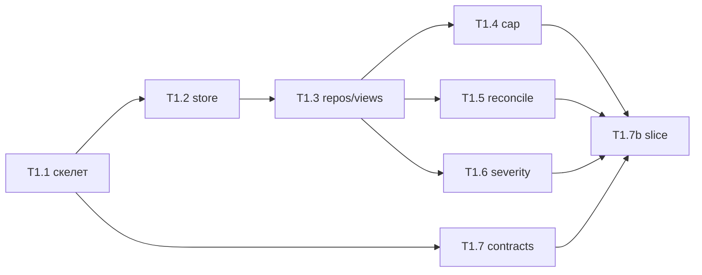

# Совместное ревью границ пакета P1-A

Дата: 2026-08-06. Автор ревью: независимый проход с нуля по планам
`t1.1`–`t1.7b`, шаблону, `docs/design/*` и `decision.md`. Предыдущие review-
файлы и их git-история **не читались**.

Статус: **пакет в целом годен как implementation baseline после точечных
правок**. Критических дыр во владении findings-протоколом нет; есть несколько
разрывов между обещанием рубежа и фактическим покрытием планов, плюс риск
позднего схлопывания sibling-API на T1.7b.

Критерии совместного ревью из `task-plans.md` §3.1:

1. владение правилами между DDL, репозиториями, доменом и валидатором;
2. единые типы/ID;
3. транзакционная граница вертикального среза.

---

## 1. Вердикт одной фразой

P1-A правильно режет review-core на чистые домены + store + валидатор + тонкий
application-срез, и на бумаге это действительно может поймать ошибки на швах,
ради которых добавили T1.7b. Но формулировка рубежа M1 в графе завышена, оценка
T1.7b занижена, а часть несущих путей T1.5 (human-reopen, reconcile_failed) на
настоящей базе пакетом не доказывается.

---

## 2. Что ревьюировалось

| Артефакт | Роль |
|---|---|
| `docs/task-plans/p1-a/t1.1.md` … `t1.7b.md` | восемь планов пакета |
| `docs/task-plans/TEMPLATE.md` | структурный контракт плана |
| `docs/design/task-plans.md` §2–§5, §3.1, §8–§9 | рубежи, граф, пакеты |
| `docs/design/architecture.md` §3, §6–§7 | раскладка и review-workflow |
| `docs/design/db-schema.md` §5, §10–§14 | DDL, инварианты, уточнения |
| `docs/design/agent-contracts.md` §4, §6, §11 | восемь проверок и follow-up |
| `docs/metaResearches/decision.md` §6–§8, §14 | протокол и приёмка |

Код не ревьюировался: его ещё нет. Это ревью исполнимости планов и дизайна, не
диффа реализации.

---

## 3. Как это должно работать целиком

Исполняемый смысл пакета:

1. **T1.1** даёт устанавливаемый `metaswarm` и одну locked-команду проверки.
2. **T1.2** прячет SQLite за единственным writer-thread и `transaction(fn)`.
3. **T1.3** даёт typed persistence и доказывает constraint-половину инвариантов
   вставкой нарушений.
4. **T1.4 / T1.5 / T1.6** — три независимых чистых домена без store-imports:
   кап/переходы, reconciliation/личности, severity/периоды/споры.
5. **T1.7** — ранняя машинная граница восьми ответов агентов; store не читает.
6. **T1.7b** — единственный композитор: marked fixtures → T1.7 → domain →
   repositories внутри TX → SQL views. До `AskHuman(cap_exhausted_new)` и
   физической `branch=blocked`.

Это совпадает с гибридом из `task-plans.md` §8.3: чистая комбинаторика там, где
она таблична; швы — на настоящей базе без CLI.

Типичный несущий путь T1.7b:

1. две blind-линии → observations → reconciliation → два `F-*`, `post_check`;
2. author revision + `issued` roster;
3. owner `insists` + follow-up → direct `recurrence` → `policy_closed` ниже порога;
4. ещё две правки по второму finding;
5. на check 4: `verified_fixed` старого + `new_observation` → T1.5 выдаёт новую
   личность с `first_round_id` текущего круга;
6. T1.4 видит исчерпанный cap и новую identity → `cap_exhausted_new`;
7. formatter получает готовый `AskHuman`, одна TX пишет question/outbox/blocker/
   `blocked`.

Порядок ветвей T1.4 (`clean → dispute → revision → cap`) и timing счётчиков
(`review_check_count_before` до закрытия текущего круга) в планах прописаны
явнее, чем в кратком псевдокоде архитектуры — это плюс: off-by-one здесь
исторически ломался.

---

## 4. Владение правилами

| Правило | DDL / T1.2–T1.3 | Домен | T1.7 | T1.7b |
|---|---|---|---|---|
| Один link на observation | PK | — | форма | пишет / гейт unlinked |
| `issued` vs `post_check` (Q47) | CHECK + enum | T1.5 intents | — | roster + strict gates |
| Кап и off-by-one | counters view | **T1.4** | — | собирает `CheckFacts` |
| Восемь проверок reconciliation | — | **T1.5** | snapshot/aliases | mapping only |
| Q44 `reaffirmed_closed` | — | **T1.5** | ledger scope | — |
| Follow-up только при open decision (Q45) | — | T1.6 period | **пара решений** | атомарная запись |
| Severity/period/oracle | views | **T1.6** | XOR формы | cross-check vs views |
| Несколько disputes → один gate (Q46) | — | T1.6 aggregate + T1.4 | — | один question |
| Human gate = физический stop (Q48) | blocker/state | AskHuman | — | **атомарная TX** |
| Публичные `F-/O-/Q-` | allocators T1.3 | intents без ID | — | применяет в TX |

Двойные проверки здесь не дублирование ради объёма, а разные слои:

- T1.7 отсекает мусор до домена и даёт retry feedback;
- T1.4–T1.6 держат несущую семантику на уже typed values;
- SQL views / CHECK ловят то, что код мог забыть при прямой вставке;
- T1.7b повторяет domain recheck на актуальном ledger внутри TX.

Это соответствует заявленному критерию пакета. Главный риск не «кто владеет», а
«совпадут ли имена и формы после параллельной реализации» — см. F-2.

---

## 5. Границы пакета относительно M1 / M1b

### Что пакет реально закрывает

- кап 3/4 и обе off-by-one границы (unit T1.4 + сценарий T1.7b);
- `cap_exhausted_new` через `new_observations` (достижимость доказана планом);
- Q44–Q48 на уровне контрактов и вертикального среза;
- constraint-инварианты схемы и enum FK;
- pure severity/period oracle против SQL views;
- атомарность decision + follow-up + recurrence;
- human gate как `blocked` + blocker, а не декоративный outbox.

### Что пакет сознательно не закрывает (и это нормально)

- ответ человека, reask, `awaiting_continue` — T1.16 / P1-C;
- процессы, адаптеры, recovery — P1-B/C;
- полный §14 `decision.md` — большая часть физически позже (kill, Telegram,
  git mutate, YAML drift, граф…).

### Где обещание рубежа расходится с планами

В `task-plans.md` §2 для **M1** написано: «Вся комбинаторика §14 `decision.md`
проходит без единого процесса». Это неверно относительно:

- самого §14 (там убийства процессов, Telegram, git, YAML, instance lock…);
- T1.22a (явно откладывает graph-сценарии и собирает reachable subset на M3);
- состава P1-A (один несущий SQLite-путь + unit-матрицы доменов).

Пакетный выход в §3.1 сформулирован мягче и честнее: «findings-протокол на
чистой логике и настоящей SQLite». **Именно его** нужно считать контрактом
приёмки P1-A; строку M1 в §2 надо сузить, иначе baseline обещает неисполнимое.

---

## 6. Findings

Сортировка: сначала то, что реально ломает приёмку или реализацию, потом
шум/мелочи.

### F-1 · Завышенный критерий M1 в графе

**Серьёзность:** высокая (документ / приёмка)  
**Где:** `docs/design/task-plans.md` §2, строка M1  
**Суть:** «вся комбинаторика §14» недостижима в P1-A и противоречит §3.1 и
T1.22a.  
**Что сделать:** переписать M1 как «несущая комбинаторика findings-протокола
(кап, reopen-правила, severity/period, contract errors reconciliation) на
чистых функциях»; полный §14 оставить распределённым по M2/M3/T2.x. Пакетный
выход §3.1 можно оставить почти как есть.

### F-2 · Поздний шов четырёх sibling-API только в T1.7b

**Серьёзность:** высокая (исполнимость)  
**Где:** планы T1.4–T1.7 (параллель от T1.1/T1.3), T1.7b §4–§5  
**Суть:** T1.4/T1.5/T1.6 намеренно не импортируют друг друга; T1.7 строит свои
context types. Первый настоящий consumer — T1.7b. Несовпадение
`EscalationBatch` ↔ `EscalatingDisputes`, ledger shape, `PrimaryRoundOutcome`
mapping и joint `domain.review.__init__` всплывёт поздно и дорого.  
**Что сделать до baseline:**

- зафиксировать в одном месте (короткий `p1-a/contracts-sketch.md` или раздел в
  T1.7b) таблицу публичных типов и обязательных mapping-строк;
- либо добавить в T1.4–T1.6 крошечный compile-time/import smoke без I/O, который
  только проверяет, что ожидаемые символы существуют после merge;
- не считать «механический rename в adapter» дешёвым: перенос authority уже
  описан как возврат на ревью — хорошо, но нужен ранний сигнал.

### F-3 · Оценка T1.7b = 2 дня нереалистична

**Серьёзность:** высокая (план-график / качество)  
**Где:** `t1.7b.md` паспорт; граф §5  
**Суть:** пять application operations, четыре integration-модуля, fault
injection по каждому write, три round gates, sibling run_state, Q45/Q47/Q48,
oracle vs views — это ближе к 4–5 дням первого прохода, не к двум. Риск из
самого плана («к концу первого дня primary+recurrence не зелёные») уже
признаёт перегруз, но оценка в графе не скорректирована.  
**Что сделать:** поднять оценку в графе и плане до честной; не резать gates и
rollback matrix. Иначе M1b будет «зелёным» ценой выкинутых негативных швов.

### F-4 · Human-reopen и reconcile_failed не доказываются на SQLite в P1-A

**Серьёзность:** средняя (покрытие рубежа)  
**Где:** T1.5 AC-7/AC-8/AC-10 vs T1.7b FAIL-2 / non-goals  
**Суть:** граф T1.5 требует: human-закрытый reopen ждёт человека, соседняя
ветка работает; exhaustion даёт raw question. Unit-тесты T1.5 это покрывают.
T1.7b явно помечает pending human reopen как unsupported vertical path и не
пишет reconcile_failed. Значит на настоящей базе пакет доказывает в основном
cap/dispute-подобный gate, но не двухшаговый reopen-human.  
**Что сделать:** либо добавить в T1.7b узкий integration case
`AwaitHumanReopen` → branch blocked + сосед running (без ответа T1.16), либо
явно вычеркнуть этот путь из пакетного определения M1b и перенести в T1.16
acceptance. Сейчас молчание между «T1.5 готово когда…» и «T1.7b не входит»
оставляет дыру в совместном ревью.

### F-5 · Durable unlinked `new_observations` между двумя TX

**Серьёзность:** средняя (дизайн / следующий пакет)  
**Где:** T1.7b AC-6, INV-6; architecture §6.3  
**Суть:** decision TX законно сохраняет observation без link; reconciliation
TX дописывает личность позже. Между ними круг нельзя закрыть (гейты) — хорошо.
Но durable «дырявый» круг существует до P1-B/C recovery. Это не ошибка P1-A,
если не заявлять устойчивость к kill.  
**Что сделать:** в baseline пакета одной фразой зафиксировать: «незалинкованные
observations после succeeded decision — допустимое промежуточное состояние;
его ремонт — T1.10*, не регрессия T1.7b». Иначе следующий пакет может принять
это за баг схемы.

### F-6 · Дрейф двойной валидации reconciliation (T1.7 ↔ T1.5)

**Серьёзность:** средняя  
**Где:** T1.7 INV-7 / AC-5; T1.5 FAIL-1…8; agent-contracts §4  
**Суть:** одни и те же восемь правил описаны дважды разными типами. При правке
контракта легко поправить только один слой.  
**Что сделать:** в обоих планах добавить явную строку «изменение любой из
восьми строк §4 = одновременный diff T1.5+T1.7+контракт»; в T1.7b — хотя бы
один case, где T1.7 пропускает, а T1.5 ловит несущую семантику (или наоборот
для snapshot-only правила).

### F-7 · T1.3 и T1.7 шире, чем нужно для выхода P1-A

**Серьёзность:** средняя (объём / оценка)  
**Где:** T1.3 (task_graph constraints, telegram_inbox UNIQUE, AttemptRepository
целиком); T1.7 (graph/cutoff/verification schemas)  
**Суть:** для M1b достаточно review-core. Полный schema suite и все восемь
agent schemas полезны как ранняя страховка, но раздувают 2-дневные задачи.  
**Что сделать:** не выкидывать (единый валидатор и inventory схемы — здравые
ставки), но честно поднять оценки T1.3/T1.7 или сузить write-surface T1.3 до
операций, которые реально зовёт T1.7b, оставив constraint-тесты на «лишних»
таблицах без полного Attempt API.

### F-8 · Мелкая рассинхронизация «семь» vs «восемь» проверок

**Серьёзность:** низкая  
**Где:** `t1.3.md` §3 non-goals: «семь контрактных проверок»  
**Суть:** в контракте и T1.5 — восемь. Это след старой редакции.  
**Что сделать:** заменить на «восемь».

### F-9 · POSIX-only check при разработке с Windows-хоста

**Серьёзность:** низкая (операционка)  
**Где:** T1.1 допущения; `decision.md` §4  
**Суть:** решение уже говорит, что Windows — только IDE-копия, рантайм в
WSL2/VPS. План согласован. Риск только человеческий: реализовать T1.1 «на
PowerShell» в обход.  
**Что сделать:** ничего в дизайне; в README/T1.1 уже достаточно.

---

## 7. Где тех-дизайн может ошибаться (не только планы)

Эти пункты — не «планы отклонились от дизайна», а места, где сам дизайн стоит
перепроверить до кода.

### D-1 · `campaign=fix_cycle` при `branch=blocked`

Семантика Q48 верная (человек ещё может дать extra revision), но оператору и
будущему scheduler легко перепутать «кампания активна» с «ветка работает».
Планы это держат; всё же стоит в CLI/run_state (позже T1.19) никогда не
показывать `fix_cycle` без явного `blocked/waiting_human`. Иначе ложные
«почему не идёт правка».

### D-2 · Hybrid «pure + один vertical path» недоказывает комбинаторику

История с `MAX`/`MIN` в period view — сильный довод за T1.7b. Но один сценарий
до `cap_exhausted_new` не заменяет таблицу пересечений
(dispute+cap, reopen+new_observations, policy_closed+clean, multi-lane owners).
Unit-матрицы доменов закрывают оси по отдельности; пересечения — в основном
надежда на T1.7b negatives + будущий T1.22a. Для M1b этого достаточно, если не
притворяться, что §14 уже зелёный.

### D-3 · Application layer как единственный композитор — хрупкая точка

Архитектура запрещает домену знать store — правильно. Цена: вся склейка живёт
в `ReviewTransactions`. Любая новая ветвь протокола (reopen-human persistence,
reconcile_failed, later disposition quirks) будет толстеть этот файл. Уже в
T1.7b пять методов. Имеет смысл заранее принять правило: новый несущий переход
= новый named method, а не ветка внутри `finalize_*`.

### D-4 · Inventory `61/24/6/6` как жёсткий AC

Числа сейчас совпадают с `db-schema.md`. Но любой мелкий DDL-fix во время
реализации ломает AC T1.2/T1.3 целиком. Это правильно как предохранитель
«не молча менять схему», но процесс должен быть: сначала design diff, потом
миграция, потом планы — иначе T1.2 утонет в churn inventory.

---

## 8. Соответствие шаблону и структурная приёмка

По двенадцати разделам все восемь планов заполнены; открытых вопросов нет;
AC↔V трассировка в целом дисциплинированная; non-goals ссылаются на ID
владельцев; inspection для import/diff boundaries — сильная сторона пакета.

Замечания не структурного отказа, а качества:

- baselines кода у планов разные (ожидаемо до package baseline) — после
  совместного ревью нужен **один** baseline-коммит пакета, как требует §3.1 п.4;
- document baseline у T1.2–T1.7b общий (`0bc5da76…`), у T1.1 старше — для
  скелета приемлемо;
- T1.6/T1.5 сознательно не трогают `domain/review/__init__.py` — хорошо против
  merge-конфликта, плохо против discoverability до T1.7b (см. F-2).

---

## 9. Что будет, если реализовать «как написано»

Вероятный ход:

1. T1.1–T1.2 проходят относительно гладко.
2. T1.3 либо укладывается, либо съедает лишний день на manifest 37 enum FK и
   пять repos — но даёт твёрдый пол.
3. T1.4/T1.5/T1.6/T1.7 идут параллельно и зеленеют порознь.
4. T1.7b вскрывает 3–10 несовпадений типов/порядка вызовов и пару дыр в
   repository API; часть уходит обратно на ревью владельцев.
5. Несущий сценарий `cap_exhausted_new` на file-backed SQLite становится первым
   настоящим доказательством протокола.

Это именно тот риск, на который пакет рассчитан. Он приемлем, если не сжимать
T1.7b и не объявлять M1 = весь §14.

---

## 10. Рекомендация

**Принять P1-A как implementation baseline после обязательных правок:**

1. сузить формулировку M1 в `task-plans.md` §2 (F-1);
2. закрыть F-4 явно (узкий integration case или перенос из M1b);
3. поднять оценку T1.7b (и при необходимости T1.3/T1.7) в графе (F-3, F-7);
4. добавить краткую таблицу межмодульных типов/mapping до старта кода (F-2);
5. поправить «семь» → «восемь» в T1.3 (F-8);
6. зафиксировать статус unlinked post-decision observations для следующего
   пакета (F-5).

После этого — один baseline-коммит пакета и последовательная реализация по
графу. Менять контракт findings / остановку ветки без отдельного разговора с
владельцем **нельзя**; остальное из F/D — обычная гигиена перед кодом.

---

## 11. Покрытие ревью

| Вопрос совместного ревью §3.1 | Оценка |
|---|---|
| Владение правилами DDL / repo / domain / validator | Согласовано; слои явные |
| Единые типы/ID | Замысел верный; риск позднего merge (F-2) |
| Транзакционная граница вертикального среза | Сильная; named ops + gates + Q48 |
| Готовность объявить M1+M1b | Готова после правок F-1/F-3/F-4 |

Не смотрелось: старые review-файлы, agent transcripts, код, fixtures vendor CLI
(для P1-A не нужны).
